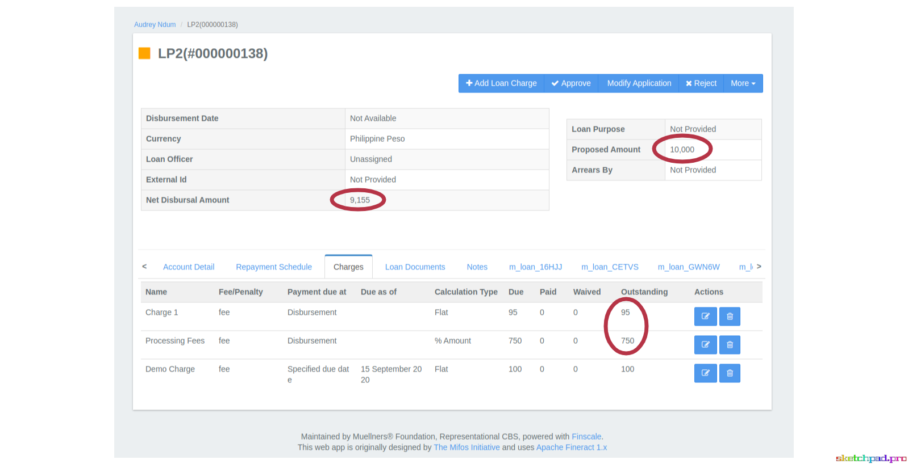
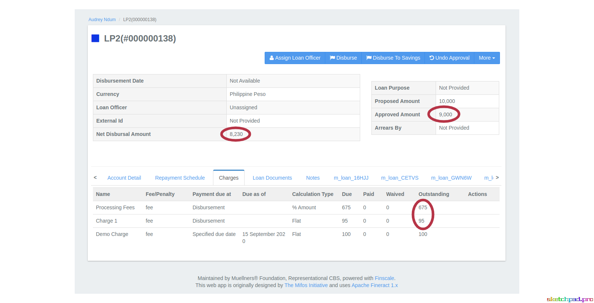
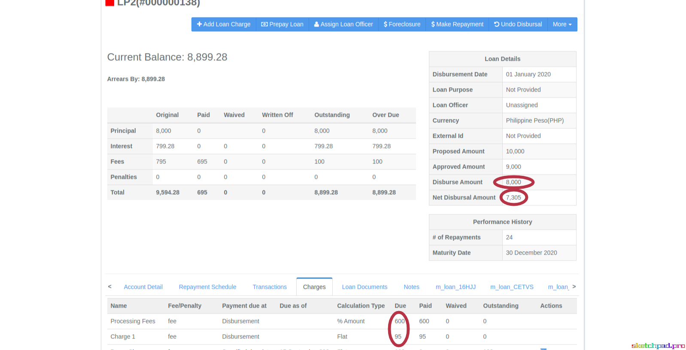
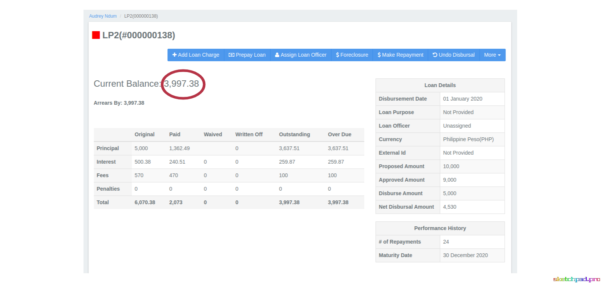
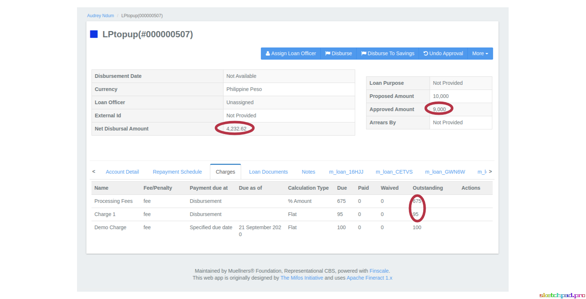
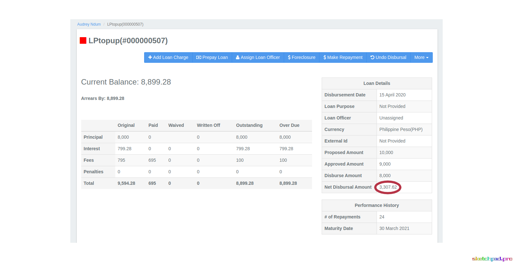
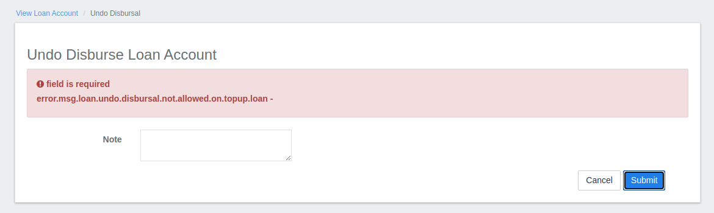

## `Adding Net Disbursal Amount logic to different Loan Lifecycle Events`

_Net Disbursal Amount (NDA) represents the actual loan amount disbursed void of any fees or costs of the financial transactions. I worked on implementing this feature at certain event states of a loan’s lifecycle, for two loan categories - regular loans and refinanced loans._

NDA is an attribute included and recalculated with respect to certain events such as Approval, Disbursal, Reversal of both Approval and Disbursal of a loan lifecycle. As such, the indicative net disbursal amount is based on the loan amount at varying points of this cycle. These arithmetics are done for regular loans, but also enhanced for refinanced loans by taking into consideration the topup amount of the previous loan to be closed.

## 1. Loan lifecycle event states:
- Pre-Approval
- Post-Approval
- Post-Disbursal
- Disbursal Reversal
- Approval Reversal

## 2. For a Regular Loan:
Consider the following scenario:  Let’s use philippine peso as the choice of currency here.
A loan application is submitted with a proposed amount of PHP 10,000. Assuming there are two charges;
* charge 1 - fee due at disbursement which is a flat amount of 95 PHP
* charge 2 - fee due at disbursement which is 7.5% of the loan amount

### A. Pre-Approval Event:
This state signifies that the net disbursal amount is calculated with respect to the **proposed** loan amount for the loan application. In other words:

NDA = Proposed Amount - Charges at Disbursal

Considering the scenario mentioned above and assuming the amount proposed was 10,000 PHP, the net disbursal amount will be calculated as follows:

NDA = 10,000 - (95 + 750) = 9155 PHP

_**Figure 1:** NDA calculated pre-approval of regular loan based on proposed amount_

### B. Post-Approval Event:
Here at this stage, the Net Disbursal Amount is calculated with respect to the **approved** loan amount for the loan. In other words:

NDA = Approved Amount - Charges at Disbursal

Considering the scenario mentioned above and assuming the amount approved was 9,000 PHP the net disbursal amount will be calculated and in fact updated from the previous stage in the fashion below:

NDA = 9,000 - (95 + 675) = 8230 PHP

_**Figure 2:** NDA recalculated post-approval of regular loan based on approved amount_

### C. Post-Disbursal Event:
This stage signifies that the Net Disbursal Amount is calculated with respect to the **disbursed** loan amount for the loan. In other words:

NDA = Disbursed Amount - Charges at Disbursal

Considering the scenario mentioned above and assuming the amount disbursed was 8,000 PHP, the net disbursal amount will be calculated and in fact updated as follows:

NDA = 8,000 - (95 + 600) = 7305 PHP

_**Figure 3:** NDA recalculated post-disbursal of regular loan based on disbursed amount_

### D. Reversal of Loan Disbursement:
After disbursal of the loan, if say the disbursal is reversed, then we are looking at the case of disbursal transaction to roll back. The Net Disbursal Amount is calculated and updated again with respect to the **approved** loan amount. In other words:

NDA = Approved Amount - Charges at Disbursal

Considering the scenario mentioned above and assuming the amount disbursed was 8,000 PHP, the net disbursal amount will be calculated as follows:

NDA = 9,000 - (95 + 675) = 8230 PHP

### E. Reversal of Approval of Loan
If an approved loan is tempted to be reversed, the Net Disbursal Amount is recalculated with respect to the **proposed** loan amount. In other words:

NDA = Proposed Amount - Charges at Disbursal

Considering the scenario mentioned above, the amount proposed was 10,000 PHP. The net disbursal amount will be calculated as follows:

NDA = 10,000 - (95 + 750) = 9155 PHP

## 3. Now, for a Refinanced Loan using the Top Up Feature:
Consider the following scenario:

A loan application is submitted with a proposed amount of 10,000 PHP. Assuming there are two charges, the similar type that I considered in above use case -
* charge 1 - fee due at disbursement which is a flat amount of 95 PHP
* charge 2 - fee due at disbursement which is 7.5% of the loan amount

Also we are assuming the **top up balance** of the previous loan to be closed is 3997.38 PHP. This basically means that the previous loan’s outstanding balance is moved to the newly disbursed loan, thus ensuring that a refinance has taken place.

### A. Pre-Approval Event:
Here, the Net Disbursal Amount is calculated with respect to the **proposed** loan amount for the refinance loan application. In other words:

NDA = Proposed Amount - Charges at Disbursal

Considering the scenario mentioned above and assuming the amount proposed was 10,000 PHP, the net disbursal amount will be calculated as follows:

NDA = 10,000 - (95 + 750) = 9155 PHP

### B. Post-Approval Event:
Here, the Net Disbursal Amount is recalculated with respect to the **approved** loan amount for the loan. This implies that:

NDA = Approved Amount - Charges at Disbursal - Topup Balance

Considering the scenario mentioned above and assuming the amount approved was 9,000 PHP the net disbursal amount will be calculated as follows:

NDA = 9,000 - (95 + 675) - 3997.38 = 4232.62 PHP

_**Figure 4:** Previous Loan To Close (With Topup Balance)_

_**Figure 5:** NDA recalculated post-approval of refinanced loan based on approved amount_

### C. Post-Disbursal Event:
Here, the Net Disbursal Amount is recalculated with respect to the **disbursed** loan amount for the loan. This implies that:

NDA = Disbursed Amount - Charges at Disbursal - Topup Balance

Considering the scenario mentioned above and assuming the amount disbursed was 8,000 PHP the net disbursal amount will be calculated as follows:

NDA = 8,000 - (95 + 600) - 3997.38 = 3307.62 PHP

_**Figure 6:** NDA recalculated post-disbursal of refinanced loan based on disbursed amount_

### D. Reversal of Loan Disbursal:
Once a refinanced loan is disbursed, it cannot currently be reversed. Hence, you will see an error implying that undoing disbursal for a topup loan is not allowed. In this article, I'm not covering how to bypass this.

_**Figure 7:** Reversal of a disbursed refinanced loan error_

### E. Reversal of Loan Approval:
If a refinanced loan hasn’t yet been disbursed but approved and you wish to reverse this approval, then it is possible. After undoing the approval action, the Net Disbursal Amount is recalculated with respect to the **proposed** loan amount. This implies that

NDA = Proposed Amount - Charges at Disbursal - Topup Balance

Considering the scenario mentioned above, the amount proposed was 10,000 PHP the net disbursal amount will be calculated as follows:

NDA = 10,000 - (95 + 750) = 9155 PHP

_You can see from the above that the net disbursal amount feature varies for a loan based on whether it’s a regular or refinanced loan, and also based on the current event of its lifecycle._

### Let’s go a little deep and understand the code level changes, we needed to make this arithmetic work for us:

### 1. Methods Affected
* **approveApplication** in LoanApplicationWritePlatformServiceJpaRepositoryImpl class
* **undoApplicationApproval** in LoanApplicationWritePlatformServiceJpaRepositoryImpl class
* **undoLoanDisbursal** in LoanWritePlatformServiceJpaRepositoryImpl class
* **fetchDisbursementData** in LoanUtilsService
* **toData** in LoanTransaction class

### 2. Database Tables
* **File Added:** V367__loan_net_disbursal_amount.sql
* **Tables modified:**
  * Added column `net_disbursal_amount` to table `m_loan`.
  * Added column `net_disbursal_amount` to table `m_loan_disbursement_detail`.

I hope you enjoyed this guide. Feel free to write to us or join the discussion on Apache Fineract mailing list or our slack channel. 
