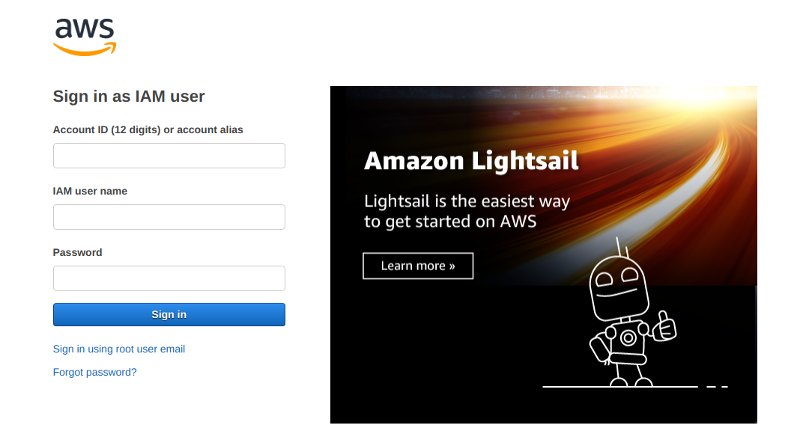
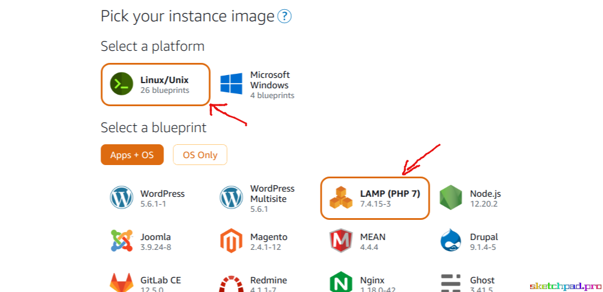
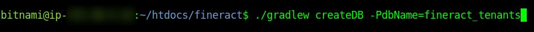
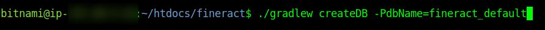
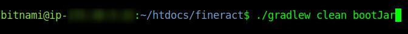
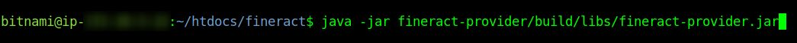
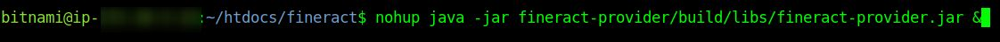
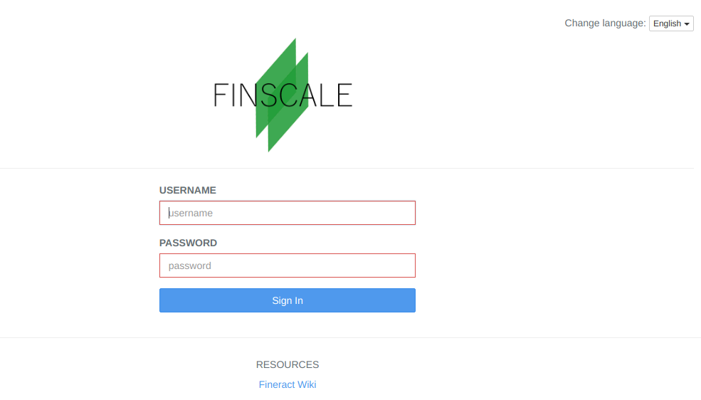
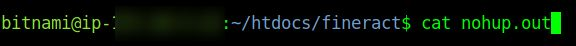
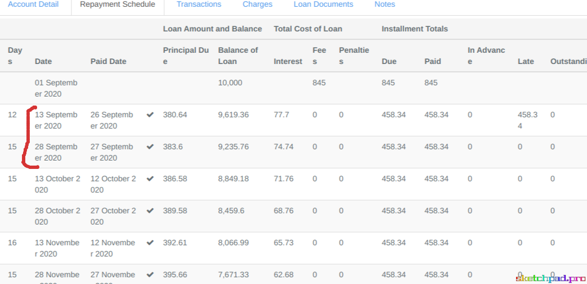

_In this blog, I am going to show you how to set up a stable deployment environment and deployment of Fineract 1.x along with the Mifos X community web app(old) on AWS. I’ve divided the entire process into a series of steps as shown below:_

1. Set up AWS Lightsail instance with Linux OS & the LAMP stack
2. For networking, set up a Static IP to later allow a domain of your choice to resolve to the community app, publicly accessible.
3. Connect to your Lightsail Instance via SSH
3. Deploying Fineract 1.x
4. Deploying the community web app on the Lightsail instance

###Few Notes:
* Checking the Database
* Checking Logs
* Common Deployment Issues and Solutions

###Few Resources: Muellners Repositories

We work on a monthly Rebase to the upstream codebase and hence our repositories are quite updated literally.

**Community Web App:** https://github.com/muellners/community-app

**Fineract 1.x:** https://github.com/muellners/fineract

###Step 1: Set Up AWS Lightsail Instance
Set Up an AWS Lightsail Instance with the appropriate stack.

####CREATE AN INSTANCE:
You need to set up a Lightsail instance which is a virtual server used to host your application.

1. First, Login to Amazon AWS Console using your credentials.

**Note:**

You ought to have access to a ‘root’ user that you created when you signed up for AWS console.
If you are not the root user, an IAM User account (hopefully your organization Admin has properly allocated roles and policies) will also let you access your AWS console. With IAM user, you will use the following to sign in:

* Account ID or Alias 
* Email
* Password

2. Next, go to “Build a solution > Build using virtual servers with Lightsail”
3. Then, select “LAMP (PHP7)” as a blueprint.

4. When you’re sure you’ve chosen your instance location, picked your instance image and plan, click on the “Create Instance” button.

####SETUP STATIC IP

Remember to set up a Static IP to this instance. It will help you in many ways. See [this article](https://lightsail.aws.amazon.com/ls/docs/en_us/articles/lightsail-create-static-ip) for instructions on how to create a static IP for any Lightsail Instance.

####SSH TO INSTANCE
Connecting to the Lightsail Instance via SSH:

The following steps involve either deploying the community web app or Fineract 1.x. In order to perform them, you will need to create an SSH connection with your Lightsail instance so that you can interact with it. There are multiple ways to do so, but what I prefer is connecting with an SSH client, using an SSH key.

* Assuming you are logged into your Amazon Console already, you can get/download your key by going to [this link](https://lightsail.aws.amazon.com/ls/webapp/account/keys).
* Depending on your OS, follow the instructions [here](https://docs.bitnami.com/aws/faq/get-started/connect-ssh/#connect-with-an-ssh-client-on-linux-and-mac-os-x-using-an-ssh-key) to connect with an SSH client.

###Step 2: Deploy Fineract 1.x
To deploy Fineract 1.x on AWS Lightsail, you would have to build a jar file of the project and run it on the Lightsail instance.

1. First, connect to the Lightsail instance as I specified in the previous step.

_Take note that version 8 of mysql was automatically installed when I chose to create the instance with the LAMP stack. By the time you read this, you might have version 8 or greater installed on your instance if you chose the LAMP stack option like I did. If this is the case, you will have to reinstall or install an additional version of mysql manually, choosing version 5.7 this time. Else, you will be unable to run the jar file in the end._

2. Next, follow [these instructions](https://github.com/muellners/fineract#requirements) to install the remaining requirements on the server. This includes Java >= 11 and MySQL 5.7.
   
_You will also have to [install docker](https://docs.docker.com/engine/install) depending on the Linux distro running on your instance (if you intend to run the MySQL server in a container)._

3. Clone the [muellners fineract 1.x repository](https://github.com/muellners/fineract) available here at https://github.com/muellners/fineract, preferably in the directory “~/htdocs”

4. After this, you have to create the required databases as shown [here](https://github.com/muellners/fineract#instructions-how-to-run-for-local-development) by running the following commands at the root of the fineract project.

5. You are now ready to [build the jar file](https://github.com/muellners/fineract#instructions-to-build-the-jar-file). This can be done by running this command

6. If you’re still at the root of the fineract project on your Lightsail instance, you can start the application using the jar file by running this command.

This runs the application on the port 8443. 

7. The nohup tool can be used to keep the process running in the background even after the shell is exited. Since it is part of GNU coreutils, you don't have to install it. It comes pre-installed in all Linux distributions.

###Step 3: Deploy the community web app:

After connecting to your instance, deploying this shouldn’t be very hard. All you have to do is build the project and host the built files.

1. The very first step is to follow the instructions about building the project from the source on the [Muellners Community Web App repository](https://github.com/muellners/community-app#building-from-source).

2. Instead of “grunt serve”, run the “grunt prod” command to build the code for production deployment (https://github.com/muellners/community-app#build).

3. Then, replace the contents of the directory “~/htdocs” with the contents of “PROJECT_PATH/dist”.
Where “PROJECT_PATH” refers to the root directory of your cloned version of the community web app on your AWS Lightsail instance.

4. And voila! You should now see your hosted version of the community web app when you go to the static IP address representing your Lightsail instance in your browser. It should look like this:

I have replaced the logo of this community app as we have been enhancing this system’s capabilities along with another open source project [Finscale](https://finscale.org).

###(Optional) Adding DNS records (If community app is public over the Internet)

It’s always preferable to point a domain name or a subdomain name, to your Lightsail instance and to use this to access the community app. This provides security settings, HTTPS, and certain benefits of caching.
Again, there exist numerous resources that can be used to achieve this, but I have chosen to use Cloudflare.

To add records manually for the domain or subdomain you want to point to this instance, 
1. Add your domain to Cloudflare. 
2. Follow [this procedure](https://support.cloudflare.com/hc/en-us/articles/360019093151-Managing-DNS-records-in-Cloudflare) to add a new record. You will have to set up an A record and point the domain to the static IP you generated in Step 1.

When all this is done, you should now be able to log into the front end application using the URL

https://yourdomain.com/?baseApiUrl=https://yourdomain.com:8443/fineract-provider&tenantIdentifier=default

###Checking the Database Connectivity Issues
1. When trying to run the built jar for fineract 1.x for the first time, you might encounter database connectivity issues such as:

Or a certain transaction error with the Drizzle driver.

Try:
* Checking your MySQL username and password match the default (`root` and `password` respectively).
* Verifying you are using version 5.7 of MySQL

2. You can check your database using phpMyAdmin. After connecting to your instance via SSH, you may encounter the following error while trying to access phpMyAdmin from your browser using the URL "https://yourdomain.com/phpmyadmin":

This can be overcome by:
* Connecting to your instance via SSH, this time using this command

`ssh -N -L 8888:127.0.0.1:80 -i yourLightsailInstanceKey bitnami@yourStaticIP`

* You should now be able to see the phpMyAdmin page when you retry the URL mentioned above.

###Checking Logs
####How to check logs?
Logs are important and occasionally, you may need to check the logs of your deployed version of Fineract 1.x. This is because they will help you to discover and solve issues quickly. They are most commonly used to discover and solve bugs in a production environment. To check the logs of the application, run this command:

###Common Deployment Issues and Solutions

1. “Couldn’t Connect to Server. Make sure you are using Correct Server Settings”

You might come across this error on the UI when attempting to log in. The most common reasons for this error are:
* The backend is not running.
* You specified the wrong base API url in your browser
* Your internet connection is unstable.

2. You may notice that after deployment, each date in a loan schedule jumps one day backwards or generally, does not conform to the dates defined by the loan product.

In the image above, the first repayment date was supposed to be on 14 September and the second on 29 September and so on.

These shifts in loan schedule dates occur due to a timezone offset and can be resolved by setting up your tenant timezone configuration based on the hosted environment of your deployment.
* You can do that by changing the tenant timezone in fineract_tenants.tenants table from Asia/Kolkata (default) to UTC.
