_I worked on a public deployment instance of Apache Fineract and stabilized this deployment for a month. During this time, I faced a lot of issues.
With this blog, I have tried my best to confront them and highlight what are the possible reasons these issues exist and what are ways to navigate through them when you are deploying Fineract 1.x._

We are using following repositories as reference forks of Apache Fineract 1.x:

###1. Fineract 1.x / Server/ Backend
**Github Link:**

https://github.com/muellners/fineract

**Deployment Types Available:**
1. Docker
2. Kubernetes

###2. Run integration test
**Github Link:**

https://github.com/muellners/fineract/blob/develop/.travis.yml

You can refer to the travis build support file;

Usual steps provided are:
* Create a test build
* Generate a fresh build and check compile

###3. Once the integration tests are complete
Deploy services

###4. Fineract Client side (Mifos X Client) community app
**Source Code (develop branch):**
* https://github.com/muellners/community-app

###5. Similar process for jenkins follows
This app is written in angular JS, need to build and deploy the solution in static server through Apache server or any server that can process JS can be used.

**Deployment Types Available:**
* Docker

**Deploy services using grunt build**
____________________________________________________________________

###Relevant Documentation:
* https://research.muellners.org/end-to-end-deployment-of-fineract/

* https://research.muellners.org/setting-up-fineract-end-to-end/

* Reference Derivative Documentation: https://docs.fineract.net

###Understand Github Workflow:
* https://guides.github.com/introduction/flow/

##Few Deployment Concerns & important notes
Let’s look at few deployment related issues now:
###A. Timezone Tenant Configuration:
Each date in a loan schedule, loan product date or charges payment date posted may jump one date back or more if the Time Zone of the Tenant is not properly set up.

**Possible Causes:**
* Time zone differences.
* Rebase of upstream code base of Apache Fineract.

**Possible Occurrence:**

This error is due to a system wide configuration, so each date in the system is likely affected. This occurs due to a timezone offset, so you might notice this on loan product based loan account schedule dates or repayment schedules right after installing 1.x.

**Solution Path:**

You need to set the tenant timezone accordingly in the tenants database. It's a required configuration. The only feasible solution is to set up your tenant timezone configuration accordingly with the hosted environment of your deployment; whether a local UAT environment or remotely accessible.
You can set it to UTC preferably. This can be done by following the steps below:
* Log into your database
* Go to the fineract_tenants.tenants table.
* Change the timezone_id from e.g, “Asia/Kolkata” which is the default to “UTC” for all tenants.

You can do this easily by using a mysql management GUI tool like phpMyAdmin. 

But if you prefer using the terminal to do so and are running mysql in a container, the following steps which are just a more detailed explanation of those listed above should suffice:

1. Log into mysql database.

Then, enter the password for the root user and you should be logged in.

Here, _“mysql-5.7”_ is the name of my mysql container, and I’m using the _“root”_ user to login.

2. Switch to tenants table

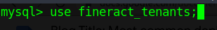

3. Change the timezone id

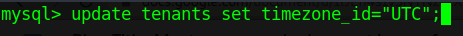

This changes the timezone_id for all tenants to _“UTC”_.
____________________________________________________________________

###B. Connection to Server Settings: Proper configuration settings:
Occasionally, you might come across this “connection to server issue” on the community app when attempting to log in. From my experience, this usually occurs when there is an issue with the database or when Fineract 1.x is unable to establish a proper connection with the database or make queries accordingly. I’ve tried to document as many potential causes and how to possibly solve them.

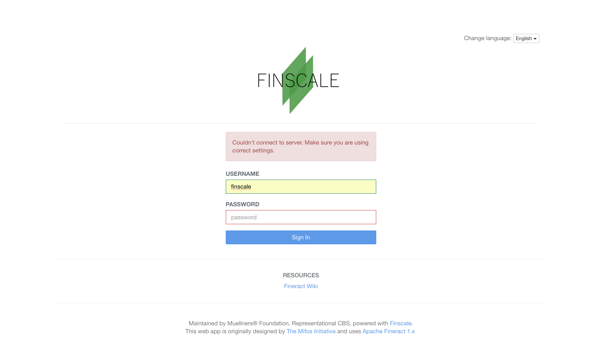

####a. MySQL Packet Size Issue:
   
**Possible Causes:**

   In runtime, Fineract 1.x’s database got a packet(size of data sent from backend to mysql database for a specific query) that was bigger than the maximum allowed. As a result of this, a community app(front end Mifos X client) user could not login. The user finds _“Connection to server error”_. This happens because the maximum allowed packet value permitted by the mysql server is 4MB by default. This is too small to handle certain queries.
   
**Possible Occurrence:**

   I came across this once while trying to log into Fineract 1.x via the Community App, you probably will too. There might be other requests made that cause this issue to popup but whatever the case, possible resolutions are defined below.
   
**Solution Path:**

   You would have to increase the maximum allowed packet value for the mysql database to 67MB or more if the server is required to handle larger queries.
1. **Option 1 (preferred)**
   
   Login to mysql and change the “max_allowed_packet” for every user to 67MB (67108864 bytes) until the server restarts. This value can be increased up to 1GB, but will reset if the mysql server restarts, even if you set it globally.

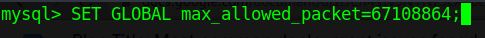

2. **Option 2**

Remove the mysql docker container. Note that doing so will delete all databases in that container.

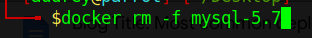

Create a new container, passing the following flag “--max-allowed-packet=67108864”

__________________________________________________________________________

####b. MySQL User Denied Access:
   Existing user access is not possible. Connection to server error:

**Cause 1: Unable to login to mysql server:**

On checking the logs (see previous blog), the following error was shown Access denied for user root@172.17.0.1 (using password: YES).

**Possible Reasons:**

Initially and by default, Fineract 1.x is connected to the default tenant database on the mysql server using a user “root” with schema server “localhost“. Details of this tenant connection parameters can be found in the fineract_tenants.tenant_server_connection table.

**Possible Occurrence:**

The error you see above comes up indicating that the application was trying to connect to a user “root“ with hostname “172.17.0.1“ which wasn’t available. Trying to login via phpmyadmin shows the same error - as below:

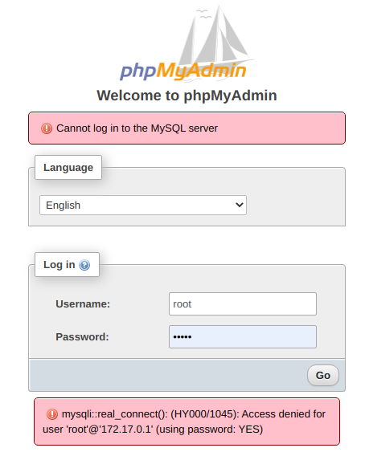

**Solution Path:**

After logging in with an existing user on the mysql server, create a new user “root“ with hostname “172.17.0.1“:
* Create user

where _“some_password“_ is the root user’s password.
* Grant all privileges to new user

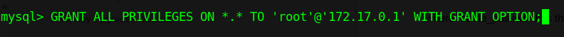
* Implement changes

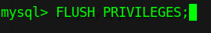

**Note:**

A new user can easily be created and granted all the required privileges using the same mysql management GUI tool e.g, phpMyAdmin.
__________________________________________________________________________

**Cause 2: phpMyAdmin data loss**

**Possible Reasons:**

A malicious user could have deleted your databases. Precautions can be taken to avoid this situation such as disabling root access and making regular backups..

**Possible Occurrence:**

On a public deployment, making use of common credentials like a root user to access the database or using a weak password can make your database liable to attack and it could possibly get deleted too!

**Solution Path: Disabling root access for security purposes**

This can be done by creating an entirely new user, granting all privileges, then deleting the root user. The default username and password are “root” and “mysql” respectively. My advice is to decide on a solid, safe password (16 characters preferably) for the new user to be created before proceeding.

To modify user access credentials, please follow these steps:
1. Login to mysql via the terminal or phpmyadmin
2. Add a new user - Pick a new username/password, assign full privileges globally, then create the user.
3. Go to the fineract_tenants>tenant_server_connections table and make the following changes:
* Replace the value of the schema_username and schema_password column by the username and password of the new user which you just created respectively.
4. Go to the “jdbc.properties” file in the codebase and change the values of:
* fineract_tenants_uid to the new user’s username
* fineract_tenants_password to the new user’s password.

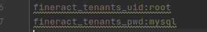

**Related Documentation**

Note: Appendix A - To change mysql username/password
* https://mifosforge.jira.com/wiki/spaces/docs/pages/74711072/Mifos+X+Installation+on+Linux+-+Ubuntu+Server
__________________________________________________________________________

###C. Multi-tenancy
Fineract 1.x supports multi-tenancy. The services are multi-tenant capable.  Data is placed in separate databases for each tenant.  Which tenant is addressed by a request is transmitted via the request header, and via the bearer token. Any deployment may serve multiple tenants.

How to create another tenant for the same instance. This can be done by:
1. Logging into the database using relevant credentials
2. Creating a new database called fineract_test (could be any name, but must be prefixed with “fineract_”)
3. Executing the following sql query to add connection details for the new tenant to the fineract_tenants.tenant_server_connections table:

Where:
* _“fineract_test”_ is the name of the new tenant database
* _“root”_ is the username used to connect to the database
* _“mysql”_ is the password used to connect to the database
4. Inserting into fineract_tenants.tenants table a new tenant:

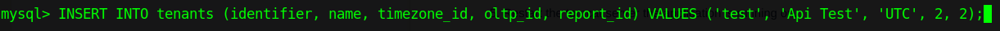

Where:
* _"2"_ represents the new tenant connection id
5. Restart the tomcat server the application is running on.

**Database name:** _fineract_test_

**Tenant Identifier:** _test_

**Community App url E.G:** _https://YOURDOMAIN/?baseApiUrl=YOURDOMAIN:8443/fineract-provider&tenantIdentifier=test_

**Login Credentials as set (default):**
* **Username:** _mifos_
* **Password:** _password_

**Few relevant documentation to use here:**
* https://docs.fineract.net/architecture/multi-tenancy
* https://cwiki.apache.org/confluence/display/FINERACT/Fineract+101
* [How to Setup New Trail Instance](https://mifosforge.jira.com/wiki/spaces/docs/pages/187498786/How+to+Setup+New+Trail+Instance)
__________________________________________________________________________

###D. Flyway Upgrades Related:
Apache fineract  will not support the Enterprise license version of flyway with MariaDB as such, this is a conflict of interest, (they had to drop GPL based Pentaho reporting engine.)

**Relevant Documentation:**
* https://issues.apache.org/jira/browse/FINERACT-810
* https://issues.apache.org/jira/browse/FINERACT-980
* https://github.com/apache/fineract/tree/develop/fineract-provider/src/main/resources/sql/migrations/core_db

DB Names have changed after the flyway upgrade in upstream code base.
____________________________________________________________________

###E. How to Maintain Regular Backups:
In the above database connection issues, I have recommended to maintain regular backups.

Mysql dump files can be generated to save or backup data from a database at any one time. This can later be recovered when need be. This comes in handy to:

* Create a db script containing specific baseline configurations relevant to a generic use case such that each time deployment fails, the script revives the db values of these configurations setup.
* Save the state of the database and recover whenever necessary.

####Backup and Restore a mysql database from a running docker mysql container
**To Backup:**

where _**fineract_default**_ is the source database and _**baseline_config.sql**_ will contain the backup data.

**To Restore:**

where _**fineract_default**_ is the destination database and _**baseline_config.sql**_ is the source from which the data is to be restored.

**Relevant Documentation:**
* https://mifosforge.jira.com/wiki/spaces/docs/pages/98107409/Mifos+X+Database+Backup+and+Restore
__________________________________________________________________________

###F. API security configuration:
API security configuration contains security context: Basic HTTPS authentication or Oauth 2.0. You will have to set up an appropriate security configuration and disable a weaker security configuration. This selection also depends on the deployment environment used and your security objectives.

**OAuth 2.0:**

OAuth 2.0 is an industry-standard protocol for authorization. OAuth 2.0 focuses on client developer simplicity while providing specific authorization flows for web applications, desktop applications, mobile phones, and living room devices. An OAuth 2.0 server is a piece of software that implements network protocol flows which allows a client (piece of software) to act on behalf of a user.
Fineract Security settings are supplied here. We can define the Oauth and Basic Auth realm settings.
The Oauth Client data is not defined in the xml file it is found here. If adding more clients, we can simply use a query like this

`INSERT INTO 'oauth_client_details' ('client_id', 'client_secret', 'scope', 'authorized_grant_types') VALUES ('community-app', '123', 'all', 'password,refresh_token');`

####Switching between Basic Auth and Oauth
It is a possibility that code level changes or Fineract improvements get shipped with a security context and configurations. If your deployment requires you to switch b/w basic authentication and OAuth, follow these steps to enable/disable oauth/basicauth for the community app and Fineract 1.x(both):

**a. For Community App**

**To enable oauth:**
* Go to `community-app/app/scripts/modules/configurations.js`
* Change the value of the _“SECURITY“_ constant to _“oauth“_.

**To enable basicauth:**
* Go to `community-app/app/scripts/modules/configurations.js`
* Change the value of the _“SECURITY“_ constant to _“basicauth“_.

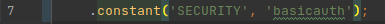

**b. For Fineract 1.x**

**To enable oauth:**

When building the application for production, add the -Psecurity=oauth flag.

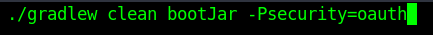

**To enable basicauth:**

When building the application for production, exclude the -Psecurity flag

__________________________________________________________________________

###G. CORS Issue
**Possible Reasons:**

If you come across this, check if both the community app and Fineract 1.x are making use of the same authentication mechanism. They should all either be making use of _"oauth"_ or _"basicauth"_.

**Possible Occurrence:**

You would most likely see this when trying to log in from the client or when making certain requests.

**Solution Path:**

Both the community app and Fineract 1.x must be configured to make use of the same authentication mechanism.

I hope you enjoyed this guide. Feel free to write to us or join the discussion on Apache Fineract mailing list or our slack channel. 
