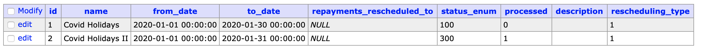
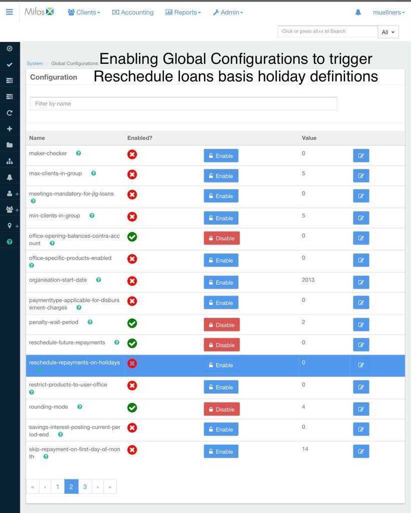
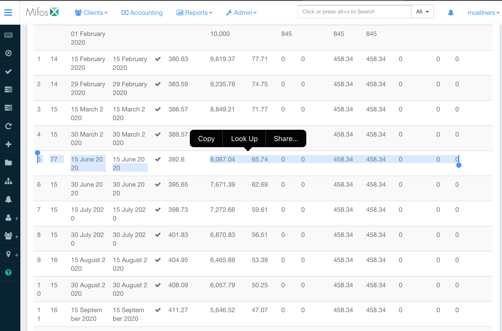

_Covid Pandemic related repayment rescheduling now possible! Both in Past and Future._

Over the past year, the coronavirus pandemic has strongly affected people&#39;s way and quality of life all over the world. Digital financial services are no exception to this appalling reality.

Apache Fineract has support for standard holiday periods and ability to bulk reschedule loans falling into such configured holiday periods.

But with the Covid-19 pandemic, we met an unprecedented long duration of time where people were laid off, on designated holidays or with pay cuts. At the same time, regulatory bodies across the world directed financial services companies to provide grace periods or interest free periods in ongoing loans provided by them.

**A lot of financial services companies using Fineract 1.x or older versions were caught off guard. They could not handle such loan rescheduling. A most common observance was segregating these loans and dumping them into workbooks, spreadsheets and rescheduling manually. Basically, a mess was created.**

**Moreover, in the upcoming future also, regulatory bodies may ask FIs to allow borrowers grace periods or loan rescheduling as far as Covid pandemic related restrictions are in place.**

The rescheduling done via Manage Holiday creates following effect for both in the Future and past dates:

1. The repayment schedule completely skips the holiday period.
2. Any dates falling during the holiday period are moved to the next repayment date.
3. If the next repayment date also falls during the activated holiday period, it further moves to the next repayment date and thus the schedule arrives on a pay cycle after the holiday period.
4. The loan term is stretched further due to the holiday period extension.

### A. FUTURE:

For the future such as March 2021 onwards, repayment holiday rescheduling, you may use Loan reschedule APIs or &quot;Manage Holiday&quot; part of Fineract. Both suit the need and if rescheduling is complex with different terms and conditions, loan\_reschedule feature of Fineract must be used instead of **Manage Holiday** \* based rescheduling.

Manage Holiday based rescheduling will be a standard and operates on system wide at once.

Here, a future date holiday period is defined from opening date to closing date.

You can configure one of these holiday periods and make it ready for rescheduling.

#It&#39;s simple, use Mifos X web client, go to the &quot;Manage holiday&quot; in Mifos X client under the Organization menu in the Admin panel. [You can use this wiki also to understand this step.](https://mifosforge.jira.com/wiki/spaces/docs/pages/67141730/Manage+Holidays)

Create a holiday for any duration of your choice.Remember to activate it. In the screenshot, I am trying to set up a holiday in the past to no avail. I will consider this example in the later part of the blog.

RESULT: The Holiday is marked Active and system wide Holiday scheduler should automatedly reschedule all loans when the holiday actually arrives in the future.

### B. PAST

 In this section, I talk about the holiday rescheduling feature&#39;s ability re-engineered in such a way that it helps the FIs using the Fineract platform for loan scheduling in the past if they missed the train.

_Let us dive into this use case with the following example. Let us say I wanted to change schedules of the following loan in the past. It is a semi monthly loan example that I have taken._

_At the database level, holidays look like this; This case shows php my admin entries for two test holidays defined from 1st Jan to 30 or 31st Jan._

_In my first code level changes attempt, clearly the Fineract system did not accept my holiday definition in the past or its application on the loan schedule in the past._

_So for simplicity, I will consider the holiday defined at the top. Remember the first screenshot, where I am trying to set up a holiday in the past. We will use that definition now._

Now, I will explain what was done;

1. Holiday rescheduling on Fineract was done as an extension to the already existing &quot;Manage holiday&quot; application infrastructure.
2. When testing the existing holiday rescheduling framework of Fineract, we realized that the holiday rescheduling had an effect of cumulating all the payments due (during the holiday period) and applying them to the next immediate non-holiday day.
3. This had the consequence of making the next open repayment to be very hefty on the client&#39;s wallet. Basically a less configurable loan repayment schedule.
 And given the long repayment holiday gap due to the Covid-19 crisis where people were not making money, this kind of scenario is really a deal breaker for FIs and a nightmare to their collections team.
4. So, a new kind of holiday rescheduling was clearly required. A type of holiday rescheduling where instead of the loan period remaining the same, it is extended.
5. This way, the repayments are not accumulated and the loan term is further extended by an amount of repayment periods equivalent to the duration of holidays.
6. This way, when borrowers are back from holidays or their ability to repay is restored, they resume their repayments as before.

In summary, the following changes were made to the holiday rescheduler:

- We re-configured holiday to adjust and extend the loan schedule accordingly instead of nulling out a holiday and cumulating the holidays repayments to a few remaining dates.
- Added a method to get the next repayment date after the configured holiday period.
- Getting the next repayment date after the holiday period was a little tricky for holiday with the option to reschedule to the next repayment date.
- To get to the next repayment date, comparisons were made between a standard loan schedule with 30 days and a semi-monthly loan with 15 days and to get the next active date after the last holiday.
- From there, we continuously generate the next dates for each subsequent repayment date in the loan schedule.

Holiday rescheduling in the past was tested using the Fineract framework by adding a case to the scheduler jobs to execute an extending rescheduling holiday.

The next thing is to enable holiday rescheduling in the system configurations like so.

Now when you create a loan application, any period of the application term that falls within the holidays period gets rescheduled on its own. Of course, an &quot;Apply Holiday to Loans&quot; scheduler &amp; &quot;reschedule repayments on holidays&quot; scheduler is active and running to perform this action.

_Below images show the configuration and the scheduler at work._

_Global Configurations to be enabled for everything to work seamlessly._

_This schedule that applies holiday on loans needs to be active and successfully running. In my first attempt, the scheduler failed and trust me my team was not happy with it. But eventually I fixed it._

_The image below shows what happens in one of those cases that we began with by applying the holiday in the past while sitting and sipping coffee in the Future. I mean today._

The enclosed area shows the two months holidays that were rescheduled in the loan repayment schedule and the loan maturity date was further extended.

Note: PAST i.e Covid 2020: For the Covid related repayment rescheduling in 2020, MANAGE HOLIDAY feature cannot be used if there are numerous use cases that do not have a fixed rescheduling requirement. E.g Some cases may have a reschedule b/w 16/03 to 30/05 while some have 01/04 to 15/05 and so forth.

It is ideal if you use loan\_reschedule API.
