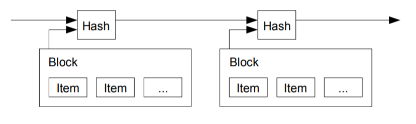
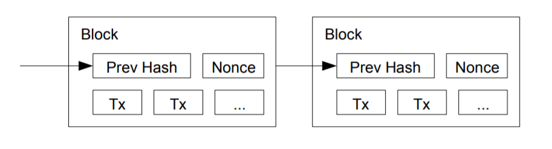
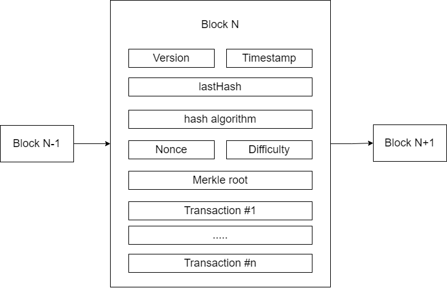

## A research based overview of Blockchain and it's application in cryptocurrency

### **Abstract** 

With the rise in popularity of terms like cryptocurrency, bitcoin, digital money and cryptography, the world is fast moving towards more secure means of money transfer and safe and immutable transactions. Blockchain provides an effective way to ensure secure and open transactions to take place without the fear of manipulation of third parties. Blockchain technology is regarded by many IT innovators and experts as one of the most significant technological innovations in recent years in the field of digitization. The technology is founded upon the concept of a distributed ledger, a way of decentralized cataloging and accounting for large volumes of data. Blockchain is viewed by many as a disruptive technology that “will revolutionize business and redefine companies and economies.” Developed as a data management technology specifically for Bitcoin cryptocurrency, the interest in Blockchain technology has been increasing since the idea was coined in 2008. 

The rise of various digital cryptocurrencies such as Bitcoin and Ethereum have emphasized the importance and upheld the relevance of blockchain and blockchain based applications. With more and more people and organizations moving towards embracing digital money and digital transactions, understanding the working of cryptocurrency becomes utmost important

### **Motivation**

The idea of Decentralized Social Networks is being favored by a community, which keeps increasing with every passing day, as more and more people become aware of and understand it. Blockchain is the technology used to implement Decentralized Social Networks, generally. Blockchain provides a wide number of values such as efficiency, transparency, privacy, reliability, incentivization and elimination of third parties. Blockchain is fast replacing traditional methods of data storage such as centralized databases owing to its properties such as immutable records, public distributed ledger and security from hackers. More and more companies and organizations are adopting blockchain into their workflows and work mechanisms. Blockchain is at the heart of crypto-currency, and hence it becomes vital for us to understand it to ensure smooth working of our product.

### **Aim and objectives**

- #### Aim:
    
    To study and understand Blockchain technology concept and it’s applications in Cryptocurrency


- #### Objectives:
    - To research about the origins and conceptualization of Blockchain Technology

    - To understand the inner working of Blockchain technology 

    - To take an overview of the cryptographic algorithms used in Blockchain technology

    - To understand the concept of cryptocurrency and its correlation with Blockchain

### **Introduction to the topic** 

Blockchain is a type of database, which collects information together in groups, also known as blocks, that hold sets of information. Blocks have certain storage capacities and, when filled, are chained onto the previously filled block, forming a chain of data known as the “blockchain.” All new information that follows that freshly added block is compiled into a newly formed block that will then also be added to the chain once filled.

One key difference between traditional databases and Blockchain, is that in traditional databases, the data can be updated as well as deleted, but in Blockchain, the addition of data is permanent and cannot be changed by anyone, thus is immutable. 

Although there exist private centralized blockchains, most blockchains are decentralized, meaning that there is no central authority that governs it. Because of the decentralized nature of Bitcoin’s blockchain, all transactions can be transparently viewed by anyone within the network.

Further details about the structure, working and security of blockchain and it’s components has been explored in the further sections.

### **Literature Review**

The idea of digital currency was first conceptualized in a 2008 paper[1] written a person or a group of persons going under the pseudonym Satoshi Nakamoto titled “Bitcoin: A Peer-to-Peer Electronic Cash System”. The paper served as Blockchain’s primary reference for implementation. As a part of the implementation, Satoshi Nakamoto created the first blockchain database. 

Within this paper, Nakamoto devised a system to solve the double spending problem for digital currency using a peer-to-peer (P2P) network. Double spending gave rise to the possibility of spending the same digital money or token twice at the same time. When such transactions are created, they go into the pool of unconfirmed transactions and from there, both the transactions that have been created with the same money get into a race. If one of them is accepted before the other, then the second one is deemed invalid and hence is discarded. However, if both transactions are picked up or accepted simultaneously, then it gives rise to the double spending problem wherein the same money has been used to complete multiple transactions. One problem to solve this was the introduction of a central authority who would oversee and manage these transactions, however this would have incurred additional costs of creating and maintaining the central authority itself. 

The solution proposed by Nakamoto eliminates the requirement of a central authority or third parties to verify the authenticity of digital transactions and instead distributes that role to all the nodes connected with the peer-to-peer network. The network timestamps transactions by hashing them into an ongoing ‘chain’ of hash-based proof-of-work, forming a record that cannot be changed without redoing the proof-of-work. To ward off attackers and hackers from changing data in the system, it’s designed in such a manner that the longest chain serves as a proof-of-work, and that as long as a majority of CPU power is controlled by nodes that are not cooperating to attack the network, they'll generate the longest chain and outpace attackers. Thus, even if any foreign attacker tries to manipulate transactions, they will be unable to match the page of chain generation in the network. 

Nakamoto’s solution began with a timestamp server. A timestamp server would work by taking a hash of a block of items to be timestamped and widely publishing the hash, such as in a newspaper. The timestamp would prove that the data must have existed at the time, in order to get into the hash. Each timestamp would include the previous timestamp in its hash, forming a chain, with each additional timestamp reinforcing the ones before it. Figure below illustrates the above concept of timestamping. 



Nakamoto went in favor of implementing a proof of work system similar to Adam Back’s Hashcash[2]. The proof-of-work would involve scanning for a value that when hashed with a hashing algorithm like SHA-256, the hash would begin with a number of zero bits. The average work required would depend on the number of these bits. Nakamoto implemented an entity called nonce which would increment until the hash would satisfy the hash’s required zero bits. Once the CPU effort has been expended to make it satisfy the proof-of-work, the block cannot be changed without redoing the work. As later blocks are chained after it, the work to change the block would include redoing all the blocks after it. Figure below illustrates the proof of work system. 



To compensate for increasing hardware speed and varying interest in running nodes over time, the proof-of-work difficulty is determined by a moving average targeting an average number of blocks per hour. If they're generated too fast, the difficulty increases. The CPU time and computing power would be leveraged to provide a steady stream of currency into the network and will provide an incentive for miners to mine more. 

Essentially, blockchain came into being with the need being an electronic payment system based on cryptographic proof instead of trust, that would allow any two willing parties to transact directly with each other without the need for a trusted third party. 

### **In depth overview of Blockchain**

#### **Structure of Blockchain**

Blockchain, which essentially means a chain of blocks, is a back-linked list of blocks of information, which is ordered. It can be stored as a flat file or in a simple database. Each ‘block’ in the blockchain can contain any kind of information, or in the generalized case of digital transactions, any number of transactions. One block must contain at least one transaction, this means that the block cannot be empty. The detailed structure of blockchain is explored in further sections. 

Blockchain primarily uses two important data structures :

- Pointers – these are variables that keep information about the location of another variable. 

- Linked lists - a sequence of blocks where each block has specific data and links to the following block with the help of a pointer. These can be unidirectional or bidirectional if the list elements are doubly linked to one another. 

#### Elements of Blockchain

Some core blockchain architecture components include the following. 

- Node - user or computer within the blockchain architecture or network (each has an independent copy of the whole blockchain ledger / data).

- Transaction - smallest building block of a blockchain system (records, information, etc.) that serves as the purpose of blockchain. One node may contain one or more transactions.

- Block - a data structure used for keeping a set of transactions which is distributed to all nodes in the network. Contains other variables, properties and metadata such as nonce, difficulty, lastHash etc. 

- Chain - a sequence of blocks in a specific order. Logically, this is similar to linked lists and are implemented as such. 

- Miners - specific nodes which perform the block verification process before adding anything to the blockchain structure. Miners get some incentive for verifying (mining) these blocks. Here, mining a block is synonymous to verifying a transaction and adding a new block to the blockchain. 

- Consensus protocol - a set of rules and arrangements to carry out blockchain operations. If the consensus protocol fails, then the chain is deemed to be invalid and this signifies breach or manipulation of data. 


Figure below illustrates a simplified view of the blockchain structure. All the blocks are connected in a linked list structure and each each block will store a reference to the previous block.


#### Block

A block is the core component of any blockchain. It contains the transactional data, metadata, a unique identifier called hash, a reference to the previous block and some other properties. Each of these is explained briefly in the following sections. 

##### Block Headers

Blocks headers contain metadata about the block, that is data that contains information about other data. Metadata contains various properties such as lastHash, nonce, difficulty, etc. which has been divided into 3 sets. 

The first set of metadata includes a reference to the previous block through its hash value. This property is essential in maintaining a secure link between all the blocks. A change in the hash value of any block will invalidate the lastHash value of the next block. 

Consider the nth block in a blockchain has a hash value of 

hash(n) = 000000000019d7789c085ae165831e934gf763ae46a4a6c172b3f1b60a8ce26f 

Then, the immediately next block, i.e. the (n+1)th block will have its lastHash value set to the hash value of the nth block.

lastHash(n+1) = 000000000019d7789c085ae165831e934gf763ae46a4a6c172b3f1b60a8ce26f

The second set of metadata consists of some properties related to the mining competition. These include the difficulty, timestamp and nonce. 

The difficulty value defines the difficulty of the problem that must be solved in order to successfully mine a new block (proof-of-work difficulty target).

The timestamp defines the exact moment of the creation of the block. The units of timestamp differs based on the programming constructs and languages used to create the blockchain. 

None is a value that is incremented to keep a count of the attempts to satisfy the conditions set by the proof of work algorithm. Until these conditions are satisfied, the nonce value is continually incremented. 

The third set of metadata includes a structure called the Merkel Tree Root. A Merkle Tree is a data structure used for efficiently summarizing and verifying the integrity of large sets of data. Merkle trees are also known as a Binary Hash Tree. Merkle Trees are binary trees containing cryptographic hashes. Merkle trees produce an overall digital fingerprint of the entire set of transactions. A Merkle tree is built by recursively hashing pairs of nodes until there is only one hash, called the root, or Merkle root.

#####	Block Transactions

Apart from the headers, each block includes a list of transactions or data that is to be stored in the blockchain database. A single block may contain one or more number of transactions. These transactions are used while calculating a unique hash code for the blocks. Thus any change in the data can cause the hash value of the block to change. Figure below illustrates the detailed structure of a block in blockchain.



#### **Hashing**
	
The process of hashing involves attaining an output of a fixed size from any given output. Hashing is achieved by passing the input through a cryptographic hash function. In the case of blockchain, each block has a hash value which represents the identity of that block across the entire chain. This hash value is obtained by passing the block metadata properties and transaction data through a hash function which uses a cryptographic hashing algorithm, most commonly the SHA256 algorithm. 

Cryptographic hash functions add security features to typical hash functions, making it more difficult to detect the contents of a message or information about recipients and senders. 
In particular, cryptographic hash functions exhibit these three properties:
- They are “collision-free.” This means that no two input hashes should map to the same output hash. 
- They can be hidden. It should be difficult to guess the input value for a hash function from its output. 
- They should be puzzle-friendly. It should be difficult to select an input that provides a pre-defined output. Thus, the input should be selected from a distribution that's as wide as possible. 

The hashing function takes in following properties as input : transaction data, lastHash, timestamp, difficulty and nonce. 

Mathematically, its represented as : 

hashedValue = hash(data,lastHash,timestamp,difficulty,nonce)

#### Hashing Algorithms

##### X11 Algorithm

The X11 cryptographic hashing algorithm utilizes a sequence of eleven scientific hashing algorithms for the proof-of-work. These eleven algorithms need to be used in a specific order to get required hash value. It is used for mining the Dash cryptocurrency. 

Compared to other popular algorithms like SHA256, the X11 algorithms is more secure, friendlier in terms of computing power and is easier to implement as it uses eleven pre-written algorithms. However, modifying the algorithm for specific purposes becomes extremely difficult. The X11 also has witnessed some security issues previously which is why other algorithms are explored. 

##### SHA256 Algorithm

For messages with a length no more than 264 bits, the hash algorithm SHA256 will produce a hash value with a length of 256 bits, which is called a message digest. (message digest is a 32-byte array that can be represented by a hexadecimal string of length 64). The SHA256 is the most commonly used hashing algorithm and is also used in the Bitcoin blockchain. Owing to the fact that it hasn’t been cracked yet and the hashes are calculated quickly in comparison to the other secure hashes like the SHA-512 and X11, we’ll be going forward with the SHA256 algorithm as our base cryptographic hash algorithm. 


####  Hash Checking

Hash checking is the method of inspecting if a hash value is correct by regenerating a newHash using the same original input data and then comparing the test hash against the newHash. An important point to note here, is that this is not the same as ‘decrypting’ the hash value. Decryption involves breaking down the result and reversing the operations performed on it to get back the input. Because it is impossible to decrypt a hash generated by the SHA256 algorithm, we employ hash checking to confirm hash validity. The pseudo code for hash checking can be written as follows : 

```typescript
const hashCheck(originalHash, input): boolean
{
	
    // originalHash => hash to test against
    // input => input data used for generating originalHash

	var newHash = hash(input)
	return originalHash == newHash
}
```

Hash checking is often employed while implementing the replacement chain policy of blockchain in order to verify if the new chain is valid. 

#### **Working of Blockchain**
	
 

1.	A new transaction is created. 

Whenever a transaction is created, the data is generated and packed together to store inside a block. 

2.	The transaction is stored inside a block

The newly created transaction is stored inside a block and the data associated is used along with the block metadata to generate a unique hash for the block. This process is called mining a block. The pseudo code for mining a block can be written as follows : 

```typescript
const mineBlock(data, lastBlock): Block
{
    // data => transaction data to be stored in block
    // lastBlock => the last block of the chain

    var timestamp, hashValue, difficulty, nonce = 0
    var lastHash = lastBlock.hashValue

	do 
	{
        nonce++
        timestamp = time.now
        difficulty = adjustDifficulty(lastBlock, timestamp)
        hashValue = hash(data, lastHash, timestamp, nonce, difficulty)
    } while (hashValue.substring(0, difficulty) != '0'.repeat(difficulty))

    return new Block(data, timestamp, hashValue, nonce, difficulty, lastHash)
}
```

3.	The block is propagated to every node in the network

Since all the nodes are connected to one another in a peer to peer network, the node which wants to add this new block broadcasts it across the whole network, thus every other node receives this block for further verification. 

4.	Every node validates this transaction

Once every node receives the block, they need to verify if the block is correct. This is done to ensure that there is no discrepancy in the database content. Block validation involves hash checking discussed previously as well as additional checks involving the chain. 

5.	Block is added to existing chain of blocks

Once every node verifies the block, it adds the block to its current blockchain copy. Internally, the node may create a copy of the current blockchain, append the new block to it and replace the current blockchain with the newly created chain. In such cases, the node follows a replacement chain policy discussed in further sections. 

6.	Transaction is complete

Steps 1 through 6 are repeated for every new block that is created and for every new transaction if one transaction is stored in one block. 

#### **Chain Validation in Blockchain**
	
Whenever a node is validating a block to be added to the chain, apart from hash checking, it also performs some other checks to make sure that the new block follows the norms set by the genesis block and that the current chain is valid. The pseudo code can be written as : 

```typescript
const isChainValid(chain): boolean
{
	// chain => linked list of blocks 

	var length  = chain.length

	if(chain[0] != genesisBlock) return false

	chains.forEach((chain, i) => 
	{
		if(chain.lastHash != chain[i-1].hash) return false
		if(!hashCheck(chain.hash, chain.data) return false
	})
	return true
}
```

#### **Chain Replacement Policy in Blockchain**
	
While replacing the original chain with the new chain with the appended block, the node may choose to run some additional checks to ensure that replacing the chain wont cause any security threats. The length of both the chains is compared and if the new chain is of same or lesser length than the original chain, then that chain is deemed to be invalid and is disposed. In such a case, no chain replacement takes place. 

### **Application of Blockchain in Cryptocurrency** 

#### **Introduction**

A cryptocurrency is a medium of exchange like money ( US Dollar, INR ) but in a digital form which uses encryption techniques to control it’s creation and verify the transfer of funds. Bitcoin and other prominent cryptocurrencies have gained much attention since the last several years. Globally known as digital coin and virtual currency, this cryptocurrency is gained and traded within the blockchain system. The blockchain technology adopted in using the cryptocurrency has raised the eyebrows within the banking sector, government, stakeholders and individual investors. 

Bitcoin, introduced by Nakamoto, was the first form of cryptocurrency to use the blockchain and is currently the most popular amongst them. Other popular currencies include Ethereum, Litecoin and Nexo. 

In India, during recent years, the utilization of technology, including blockchain, to fuel financial transactions has increased significantly. 

#### **Usage of Blockchain in Cryptocurrency**

The concept of blockchain involves mining blocks by solving complex computational problems. These problems involve trying to generate a hash that is identical or close to the target hash. Specialized people known as miners are responsible for the mining of such blocks and are responsible for the minting of new cryptocurrency units. These miners are rewarded for their efforts with a fixed amount of cryptocurrency. Once a currency has been mined, any person can own it by exchanging it with some other form of money ( essentially, the person ‘buys’ the cryptocurrency ). The price of buying cryptocurrency may vary based on the amount of currency mined so far, market situations etc. For example, as of Nov. 2020, there were around 18.5 million bitcoins in circulation. Aside from the coins minted via the genesis block (the very first block, which was created by founder Satoshi Nakamoto), every single one of those Bitcoin came into being because of miners. In the absence of miners, Bitcoin as a network would still exist and be usable, but there would never be any additional bitcoin. There will eventually come a time when Bitcoin mining ends; per the Bitcoin Protocol, the total number of bitcoins will be capped at 21 million. However, because the rate of bitcoin "mined" is reduced over time, the final bitcoin won't be circulated until around the year 2140. This does not mean that transactions will cease to be verified. Miners will continue to verify transactions and will be paid in fees for doing so in order to keep the integrity of Bitcoin's network.


1.	Difficulty Adjustment while mining currency

In order to ensure the smooth functioning of the blockchain and its ability to process and verify transactions, most cryptocurrency networks aim to have one block produced every 10 minutes or so. However, if there are one million mining miners competing to solve the hash problem, they'll likely reach a solution faster than a scenario in which 10 mining rigs are working on the same problem. For that reason, most cryptocurrencies are designed to evaluate and adjust the difficulty of mining every 2,016 blocks, or roughly every two weeks. When there is more computing power collectively working to mine for Bitcoin, the difficulty level of mining increases in order to keep block production at a stable rate. Less computing power means the difficulty level decreases. This ensures that the currency is mined at a relatively stable rate which protects it from sudden crashes.

2.	Mining Rewards

One of the biggest incentive for people to mine cryptocurrency is the mining reward, i.e. the fixed amount of cryptocurrency they receive for spending the computing power to solve the mathematical problem. The mining process required high end GPU’s and devices with extremely high computing powers. The reard amount, although fixed, changes every few years to adjust for the amount of currency mined. For example, in the case of Bitcoin, the rewards are reduced by half every four years. When bitcoin was first mined in 2009, mining one block would earn a miner 50 BTC. In 2012, this was halved to 25 BTC. By 2016, this was halved again to 12.5 BTC. On May 11, 2020, the reward halved again to 6.25 BTC. In November of 2020, the price of Bitcoin was about $17,900 per Bitcoin[3]. Fig.4.2.1 illustrates the rewards for Bitcoin mining from 2009 to 2020. 

#### **Advantages**


1.	Open code for mining crypto currency 

Cryptocurrency  applies the same algorithms that are used in online banking. The only difference of Internet banking is the disclosure of information about the users. All information about the transaction in the BTC network is shared (how, when), but there is no data about the recipient or the sender of the coins (there is no access to the personal information of the owner`s wallet). 

2.	No inflation 

The maximum number of currency in case of BTC is strictly limited by 21 million Bitcoins. As there are neither political forces nor corporations able to change this order, there is no possibility for development of inflation in the system. 

3.	Peer-to-peer cryptocurrency network 

In such networks there is no master server, which is responsible for all operations. Exchange of information (in this case — money) is between 2-3 or more software clients. All installed by users program-wallets are part of a bitcoin network. Each client stores a record of all committed transactions and the number of bitcoins in each wallet. Transactions are made by hundreds of distributed servers. Neither banks or taxes, nor governments can control the exchange of money between. 

4.	Unlimited possibilities of transaction 

Each of the wallet holders can pay to anyone, anywhere and any amount. The transaction can not be controlled or prevented, so one can make transfers anywhere in the world wherever another user with a Bitcoin wallet is located.

5.	Decentralization  

There is no central control authority in the network, the network is distributed to all participants, each computer mining bitcoins is a member of this system. This means that the central authority has no power to dictate rules for owners of bitcoins. And even if some part of the network goes offline, the payment system will continue to operate stable. 

6.	Easy to use

Using digital currencies is generally is convenient for companies. The company needs approximately 5 minutes to create a BTC wallet and immediately starts to use it without any questions and commissions. 


#### **Disadvantages**


1.	Strong volatility 

Almost all of the ups and downs of the BTC value depend directly on the declared statements of the governments of different countries. This volatility creates the problem in the short term. 

2.	Large risks 

Risks of investing in cryptocurrency are related to risk of money laundry, terrorist and other illegal activity financing, lack of a central issuer, which means that there is no legal formal entity to guaranty in case of any bankruptcy, and alike. The cryptocurrency is prone to frequent fluctuations and crashes. 

### Conclusion 

We have discussed the structure, implementation and applications of blockchain technology. As a newly emerging technology, blockchain is projected to dominate industry which is why the knowledge of it’s working proves to be useful. 

### References 

[1] https://bitcoin.org/bitcoin.pdf
<br/>
[2] A. Back, "Hashcash - a denial of service counter-measure" http://www.hashcash.org/papers/hashcash.pdf, 2002.
<br/>
[3] https://www.investopedia.com/tech/how-does-bitcoin-mining-work/