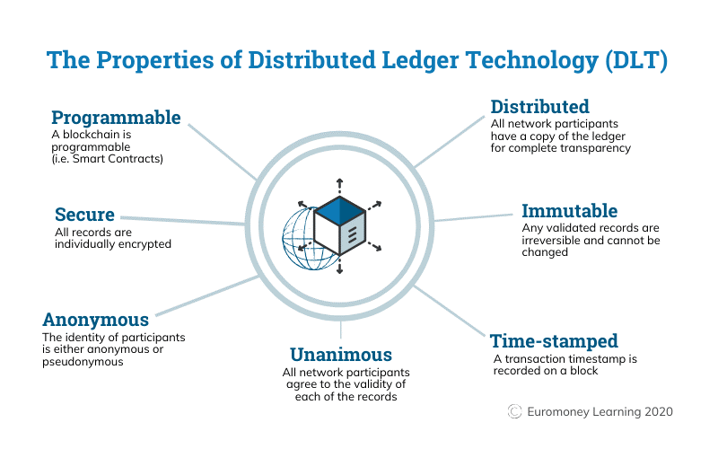
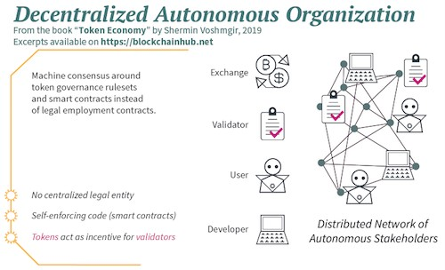

## The Rise of Decentralized Social Networks  

### **Abstract** 

Widespread use of social media has drastically transformed the way we communicate; however, many believe these changes aren’t necessarily for the good. In recent years, many social networks have caught the attention of internet activists, which brought to light the privacy-invasive model of these social networks.  They can fully grasp all users’ information, and in the meanwhile, users can only trust them for protecting their private information. However, it was revealed that these networks use this data not only for marketing purposes, but there were trades of these data between corporations as well. Data leak of this confidential user information also takes place every few months, with the most recent being Air India [1] and Dominos [2] in May 2021. Several users have expressed dissatisfaction with how major social media platforms dealt misinformation, censorship, privacy, political neutrality, user control, and malicious activities. Decentralized Social Networks, also known as Federated Networks, have emerged as a result of these concerns.

### **Motivation**

As more and more users around the world become conscious about the privacy and security-related concerns in social media platforms, alternatives to these platforms are being explored. The idea of Decentralized Social Networks is being favored by a community, which keeps increasing with every passing day, as more and more people become aware of and understand it.
Decentralized social networks bring with them a wide number of internet values, such as enhanced privacy, security, transparency, incentivization, elimination of third parties, and open-source. These are some values we believe in, and feel are the need of the time, which motivated us to choose this project.

### **Aim and objectives**

- #### Aim:
    
    To study and understand Decentralized Social Networks, and their relevance in today’s world

- #### Objectives:
    - To research the need for Decentralized Social Networks
    - To understand the services offered by Decentralized Social Networks
    - To understand what Decentralized Social Networks can be implemented with
    - To research about the existing Decentralized Social Networks
    - To understand what are Decentralized Autonomous Organizations (DAOs)

### **Introduction to the topic** 

Online Social Networks (OSNs) have become extremely popular in the last 2 decades, where users can share digital photos/videos and text entries ("posts") with their friends. As a typical example, Facebook, which already has more than two billion users [3], attracts people of different ages, genders, and cultural and national backgrounds. OSNs have become an indispensable element of many users' life. In general, OSNs aid in the transition of users' real-world relationships to the network by providing storage services for their digital information.

Many research efforts have recently been focused to the many functional aspects of OSNs, which has resulted in OSN systems being increasingly user-friendly [4]. Users' privacy, on the other hand, is found to be easily breached in OSNs. Despite the fact that most OSNs allow users to alter privacy settings to limit other users' access, there are no suitable technical methods to govern OSN providers' access or prohibit them from sharing data with third parties. For example, in March 2018, The New York Times reported that a company improperly obtained information of more than 50 million users on Facebook, and this incident occurred in 2015 [5]. Similar situations have occurred numerous times in the past. The major reason for these incidents is that the existing OSNs with central structures can fully grasp all users’ information, and in the meanwhile, users can only believe that the OSN providers can protect their private information. In this case, users cannot even be certain that the OSN providers will erase their data when they choose to delete their information after destructing their accounts. 

The scrutiny that platforms such as Facebook, Twitter and Instagram have been under in recent years appears seems to have taken its toll on consumers, who increasingly say they are losing trust in social media, with some saying they use it less as a result.
In a poll of more than 2,000 people, 63% said they had lost trust in social media platforms. As a result, 22% said they use social media less. Meanwhile, 61% of users said they were now more careful about the privacy of their posts. On political advertising, more than half (59%) said it should be regulated on social media during elections and referendums. [6]

### **Literature Review**  

### **Privacy in Existing Social Networks** 

Senthil Kumar and Saravanakumar Kandasamy observed [7] that privacy concerns are very feeble in the social networking sites, and the users’ endeavors to make the appropriate changes on the level of privacy in the social media is far lower than in other types of security operations. The users of current social networking sites are concerned about privacy issues and information disclosure breaches. They identified that many of the shortcomings and hiccups on the technical side of privacy and security measures are on the social media sites.

### **Data Security and Awareness** 

Johanna Cabalhin, in her research [8], pointed out that on many existing social networks, a user is needed to reveal a certain detail about him/herself online to prove he/she is who he/she claims to be. The more information a user shares, the easier it is to predict some of the user’s most private information using algorithms. In the US for example, a person’s social security number may be revealed or predicted at a certain level of accuracy by using a combination of hometown and birthdate. 
Facebook has close relationships with several corporations and they integrate their marketing efforts into the site by giving them special “Groups” for interested account users, which are curated using the personal information acquired from the users. This has incited a long-running debate about whether this trade of data for a "personalized experienced" is moral or not.

### **The Rise of Decentralized Social Networks**

#### **Decentralized Social Networks come into the limelight**

To accommodate the concerns regarding existing social networks, Decentralized Online Social Networks (DOSNs) have been investigated. There are several components of a Decentralized Social Network that sets it apart from a regular social media site. The first key difference is that it isn’t a standalone website that you can access — it is a network of hundreds of different communities that each own an instance of the code. It allows the participants of the social network to be more in control of their data, and decide who gets access to what part of it. It also allows the participants who are creators of some kind, to monetize and earn tokens equivalent to major cryptocurrencies, and incentivize participants who assist the network in their own ways.

#### The Promises made by Decentralized Social Networks: 

**1. Doing Away with the Centralized Bias**  

Currently, the government has the authority to censor social networks like Facebook, Twitter, etc. if the content on them is seen unfit for the general public. At the same time, social media companies have complete control over the type of material that appears on their platform and the direction that visitors are directed.
Decentralized social networks will take out the centralized bias and oversight. It will make social media networks more transparent and implement a peer-to-peer interaction-based mechanism. Instead of using personal information as a profile identifier, decentralized application development will rely on the production of unique code. The user will be able to select which data to share with the network.

**2. Eliminate the Need for Intermediaries**  

Consumers on a particular social media site are frequently targeted by fraudulent adverts and malware attacks. This occurs since, in an attempt to offer third-party tools access to data for marketing objectives, the data also falls into the hands of internet scammers. A decentralized social network developer is aware of this problem and addresses it throughout the development of decentralized applications.

A decentralized social network creates a direct connection between the participants and business logic if any. The systems allow marketers to promote their facilities to the participants as well, in a better way. Marketers may validate their data without relying on third-party technologies or middlemen with the help of this system. As a result, advertisers receive reliable data, and real consumers see their ads.

**3. User Information is Not the Product in Decentralized Apps**  

Social media platforms contain an abundance of information about their users, which they sell to the highest bidder in order to market their products. However, the bidder could be anyone – from organizations with malicious intent to government-sponsored agencies. In this system, user information is turned into a commodity that may be sold for money without the users' agreement.
Users and content creators have the right to their information and stand to benefit directly from decentralized social media, in the case of decentralized social networks. Information is securely stored into the network using modern cryptography algorithms, which makes it very hard to decrypt by anyone without the user’s permission.  This does not allow entities to sell confidential data to other entities.

**4. Scope for Crowd-funding**  

The most significant advantage of decentralized crowdfunding is the increased transparency it provides. There is a clear money trail to trace because no intermediaries are involved. This allows crowd-funding to take place at various stages, based on the proof presented by the entity requesting the funds. Furthermore, smart contracts is the technology often used by platforms to ensure that money being raised is spent on what the companies are supposed to pursue rather than being wasted.

**5. Incentivize Participants of the Network for their Services**  

Decentralized Social Networks generally run as crypto platforms; hence cryptocurrency is an excellent incentive that can be introduced in the interactions on these platforms. With the absence of intermediaries that sell user information to third parties, users can now exchange their information directly with blockchain node hosts in exchange of benefits. Users can be approached by marketers and asked whether they would want to share their data in exchange for cryptocurrencies. This financial incentive could be another reason for users to return to the network.

#### **Blockchain to the Rescue:**  

Blockchain is a system of recording information in a way that makes it difficult or impossible to change, hack, or cheat the system. [9,10]

A blockchain is a digital ledger of transactions that is duplicated and distributed across the blockchain's complete network of computer systems. Every block on the chain contains a number of transactions. Every time a new transaction takes place on the blockchain, a record of it is saved on each participant's ledger. Distributed Ledger Technology (DLT) is a decentralized database that is managed by various participants.
Blockchain is a type of Distributed Ledger Technology in which transactions are recorded using a hash, which is an immutable cryptographic signature.

#### **Blockchain-based Social Networks:**

Blockchain-based Social Networks are essentially decentralized platforms built on blockchain technology that allows for development of applications and smart contracts. These decentralized social platforms enable end-to-end encryptions for every interaction. 

Similar to Blockchain ecosystems, Blockchain-based Social Networks generally have traits such as native currency, used for:
- in-platform transactions
- rewarding users
- crowdfunding 

#### **Benefits of Decentralized Social Networks:**

**1. Users don’t have to place their trust in a central authority.**  

We put our trust in companies and governments all the time, and it's perfectly fine to make these decisions on a case-by-case basis. However, we see numerous examples of this trust failing us in various ways, ranging from the product you trusted to backup all of your photos being shut down when the startup is bought or goes out of business, to the social media company selling your data to advertisers who track you around the internet. You should be able to minimize or eliminate the trust you have to place in third parties in a well-designed decentralized network.

**2. There will be fewer single points of failure.**  

We see single points of failure all the time in the form of outages of centralized websites. When Gmail goes down, productivity suffers as a result of not being able to access your email. Your bank’s website shuts down for maintenance and you can’t do an online transfer to pay your bills. Because no single node in a decentralized network can bring the entire network down, your applications should remain up and running regardless of how many users come and go.

**3. There is less censorship.**    

It is becoming increasingly common that governments blocking individuals’ access to social media, in an attempt to suppress information about internal affairs. It is simple for them to shut down access to Twitter, because all they have to do is block traffic to Twitter's central servers. However, censoring traffic on a peer-to-peer network is significantly more challenging, because every outgoing packet sent could be connecting with another peer on the decentralized network, who could then forward that message onward.

**4. Decentralized networks are more likely to be open development platforms.**  

This means that anyone can build amazing tools, products, and services on top of decentralized networks. In contrast, centralized technology is more commonly closed off, with development prospects purposely limited. Companies can still make money if they are open and decentralized. In fact, the greater products and tools that are built, the greater the network effects that lock consumers into the network, and thus the more potential to build great businesses on top of that.

**5. Decentralized networks can be more meritocratic.**  

When everyone follows the same, transparent rules, the best product, service, or content should be more likely to be identified and rewarded over time. It's possible that the system will be less meritocratic if traffic, attention, and money are distributed behind a closed, centralized algorithm.

**Reasons why Decentralized Networks haven’t picked up yet:**

Decentralized networks come with their own tradeoffs:
- They may take longer to develop and interact with.
- They can be more expensive to run
- Mainstream customers may just not care whether or not their service's backend is decentralized, as long as they can do their intended purpose as quickly and cheaply as possible.

This being said, in light of the awareness of the invasive model of these centralized social networks, more and more people are considering switching to more secure and privacy-promising alternatives. For example, millions of users rushed to adopt Signal as an alternative to WhatsApp, as soon as Elon Musk tweeted, “Use Signal” after WhatsApp announced its data-sharing plans with Facebook. [11]

Asmita Karanje writes, “Decentralized social media platforms aren’t new, they just aren’t popular. But they might hold the key to address the problems of Big Tech”. [12]

**Major Existing Decentralized Networks:**

Minds, Mastodon, and Diaspora, to mention a few, are some of the alternatives to big tech. These aren't new; some have been around for over a decade, such as Diaspora, which debuted in 2010. Facebook, by comparison, was founded in 2006, only four years before Diaspora.

**1. Signal**

- Alternative to: WhatsApp, Facebook Messenger 
- Features: Open-source

Signal, unlike WhatsApp's end-to-end encrypted chats, does not monitor you, disclose your data, or invade your privacy.
When Edward Snowden praised Signal, it rose to fame. It became even more well-known after Elon Musk tweeted about it following WhatsApp's decision to share user data with Facebook.
Signal uses its own open-source Signal protocol to send and recieve end-to-end encrypted messages and calls. [13]

**2. Mastodon**
- Alternative to: Twitter
- Features: Open-source code base, Decentralized

Mastodon isn't a single website like Twitter; it's a network of tens of thousands of communities run by a variety of organizations and individuals to give a unified social media experience. You can either run your own Mastodon instance and connect it to other Mastodon instances, or join one of the existing Mastodon instances, such as Mastodon Social. [14]

**3. Diaspora**
- Alternative to: Facebook 
- Features: Decentralized, Open-source 

Diaspora was one of the first decentralized social networks. Diaspora was promoted as a Facebook alternative at the time, in 2010. It received some well-deserved attention in its early years, but it was limited to a small number of niche members. Diaspora, like Mastodon, is made up of pods. You can either join a pod or start your own. Your data does not belong to Big Tech; it belongs to you. [15]

**4. Minds**
- Alternative to: Facebook and YouTube 
- Features: Open-source code base, Blockchain 

You can use Minds to upload movies, blogs, pictures, and status updates. You may also securely message and video chat with groups or individuals. You can find articles of interest by using trending feeds and hashtags.
You can also get paid in tokens for your contributions. You can use these tokens to enhance your channel. Fans can send money directly to creators in USD, Bitcoin, and Ether. [16]
 

#### **Introduction to Decentralized Autonomous Organizations**

Decentralized Autonomous Organizations (DAOs) are a form of Decentralized Social Networks, which are designed to be automated and decentralized. They function as a type of venture capital fund, based on open-source code and no traditional management structure or board of directors. The DAOs are not associated with any nation-state in order to be truly decentralized.

DAOs are made up of a group of people who interact with one another using an open-source protocol that is self-enforcing. The native network tokens are awarded for keeping the network safe and completing other network tasks. Blockchains and smart contracts reduce reduce administrative transaction costs while increasing transparency and aligning the interests of all stakeholders by the consensus rules tied to the native token. Individual behavior is incentivized with a token if it helps the group achieve a common goal.

A DAO’s members are not bound together by a legal entity, nor have they signed any formal legal contracts. Instead, they are network token-linked incentives and completely transparent rules encoded into the software, which is enforced by machine consensus. Bilateral agreements do not exist. The protocol or smart contract is the only governing law that governs the behaviour of all network participants.
 

### **Conclusion**

Decentralized social media platforms still have a long way to go before they can compete with giants like Facebook, Twitter or Instagram. However, people are learning and becoming more open to the idea of decentralized social networks, combined with the potential of Blockchain – especially due to the freedom and security provided. Many are especially attracted to the easy earning opportunities and schemes of being part of a decentralized, rewards-based social network. Needless to say, they will play a significant role in the future of social media.

### **References**

[1]	Carly Page, “Air India Data Breach: Hackers Access Personal Details Of 4.5 Million Customers”, https://www.forbes.com/sites/carlypage/2021/05/23/air-india-data-breach-hackers-access-personal-details-of-45-million-customers/   
[2]	Sindhu Hariharan, “User info linked to 18 crore Domino’s orders leaked” , https://timesofindia.indiatimes.com/business/india-business/user-info-linked-to-18-crore-dominos-orders-leaked/articleshow/82898118.cms   
[3]	Mark Zuckerberg, https://www.facebook.com/zu ck/posts/10103831654565331   
[4]	Shaymaa Khater, Denis Gra’canin, Senior Member, IEEE, and Hicham G. Elmongu, “Personalized Recommendation for Online Social Networks Information: Personal Preferences and Location-Based Community Trends”, http://eng.staff.alexu.edu.eg/~elmongui/papers/tcss2017.pdf 
[5]	Matthew Rosenberg, Nicholas Confessore and Carole Cadwalladr, “How Trump Consultants Exploited the Facebook Data of Millions “, https://www.nytimes.com/2018/03/17/us/politics/cambridge-analytica-trump-campaign.html   
[6]	Sara Spary, “Fifth of people say they use social media less because they don't trust platforms”, https://www.prweek.com/article/1664220/fifth-people-say-use-social-media-less-dont-trust-platforms   
[7]	Senthil Kumar and Saravanakumar Kandasamy, “On Privacy and Security in Social Media – A Comprehensive Study”, https://www.researchgate.net/publication/301234158_On_Privacy_and_Security_in_Social_Media_-_A_Comprehensive_Study   
[8]	Johanna Cabalhin, “Facebook User’s Data Security and Awareness: A Literature Review”, https://www.researchgate.net/publication/331408062_Facebook_User's_Data_Security_and_Awareness_A_Literature_Review   
[9]	Euromoney, “What is Blockchain”, https://www.euromoney.com/learning/blockchain-explained/what-is-blockchain#  
[10]	Min Xu, Xingtong Chen & Gang Kou, “A systematic review of Blockchain”, https://jfin-swufe.springeropen.com/articles/10.1186/s40854-019-0147-z   
[11]	Elon Musk, “Use Signal”, https://twitter.com/elonmusk/status/1347165127036977153   
[12]	Asmita Karanje, “Decentralized Networks aren’t new, they just aren’t popular” , https://medium.com/swlh/decentralized-social-media-platforms-arent-new-they-just-aren-t-popular-2a3bf64a9d51   
[13]	Signal, https://signal.org/en/     
[14]	Mastodon, https://joinmastodon.org/  
[15]	Diaspora*, https://diasporafoundation.org/   
[16] Minds, https://www.minds.com/   
[17] Decentralized Autonomous Organizations, https://blockchainhub.net/dao-decentralized-autonomous-organization/  

[cover image attribution] : [https://unsplash.com/photos/5VJLeQ-TrKs](https://unsplash.com/photos/5VJLeQ-TrKs)
