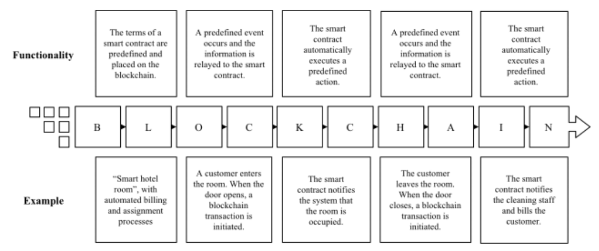
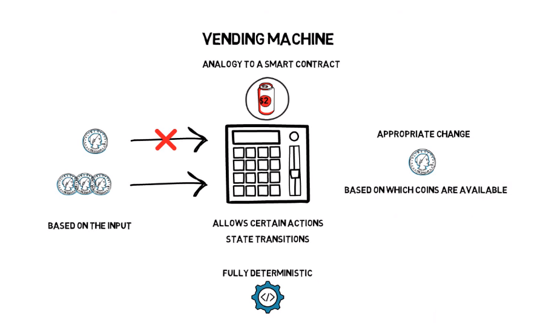
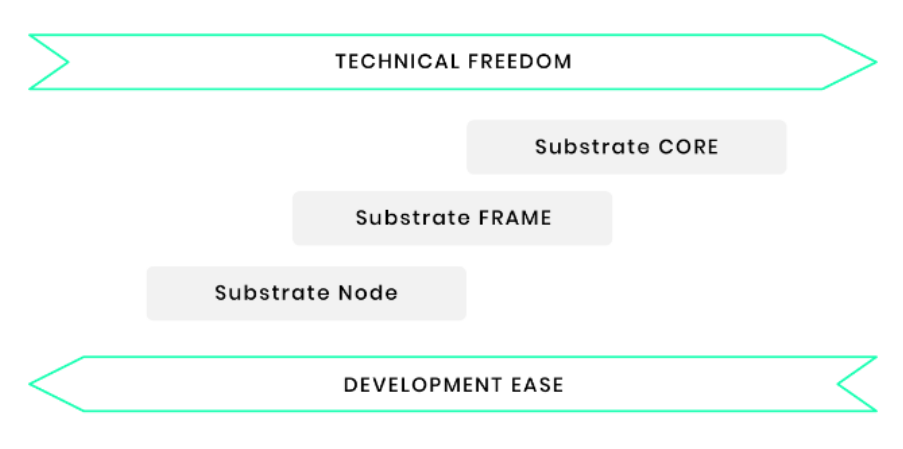
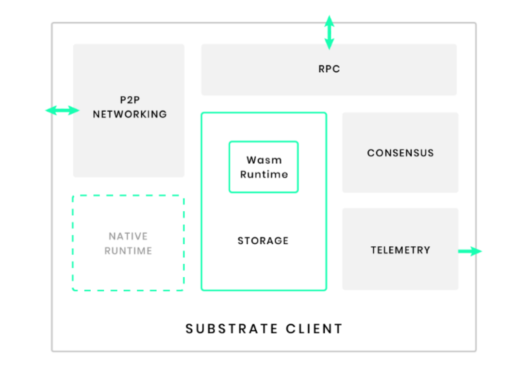

## The role of smart contracts in secure software development.

### **Abstract** 

The idea of Bitcoin was to enable private digital cash by solving the double-spending problem and thus allowing individuals to transfer money without the need for financial intermediaries (Nakamoto 2008). While Bitcoin aimed to disintermediate the financial industry, the underlying blockchain technology allows for some degree of disintermediation in almost any sector. Any asset or data can be transferred peer-to-peer (p2p) without the need for a ‘trusted’ middleman. “Smart contracts” are a way of using computers and computer networks to make contracts unbreakable. Contracting parties do not need to trust one another to perform or rely upon any middlemen to enforce performance, safety or have any contingency. Performance is guaranteed. This is supposed to be a victory for the ordinary person – a clever socio–economic application of cryptography that strips power from companies and governments and gives it to consumers [1]. This makes smart contracts very reliable and transparent, which is ideal for secure software development. Security is an important part of software development as there is a huge data flow (mostly personal and confidential) through softwares.

### **Motivation**

Smart contract research has identified a variety of target industries and use cases, such as IoT, logistics and healthcare. Besides these rather obvious fields of application, it seems likely that more complex use cases are around the corner, including for example the decentralized finance (DeFi) ecosystem. Price-stable digital currencies (so-called stablecoins) are issued and managed through smart contract protocols, and can be transferred, borrowed and lent among the users via other smart contracts without the need for any central entity like a bank. While this form of decentralized, programmable money and financial system is still in its infancy and obviously still faces many challenges, it is a suitable example of where the journey could go. It does not end with an innovative product – other projects based on it, which results in the creation of our own ecosystems. At present, this can be observed for a DeFi system whose long-term success is completely unclear. Nevertheless, this leads to innovation pressure and a similar development is conceivable for other industries, sectors and applications – a question for future studies.[4]

In addition to superordinate markets or ecosystems, the detailed examination and analysis of individual smart contract applications allows a better understanding of the potentials and challenges associated with the technology. Especially smart contracts that manage large amounts of assets (e.g. decentralized exchanges, gambling dApps or multi-signature wallets) are of interest. These can be single dApps or more complex constructs like DAOs. Research around the project The DAO can be a basis for this.[4]

### **Aim and objectives**

- #### Aim:
    To study the features of using smart contracts and understand the benefits of it in (Software Development Life Cycle) SDLC and building secure, trustless and transparent systems.

- #### objectives:
    - To understand the workings of smart contracts.

    - To study the features and use cases of smart contracts.

    - To understand how developing secure and modular smart contracts can be made easy with the Substrate framework.

### **Introduction to the topic** 

As digital data transfer becomes increasingly common for businesses of all sizes and genres, security has moved to the forefront as an important and integral element of the software development lifecycle (SDLC). Data breaches pose enormous threats to the privacy of individuals and the integrity of companies whose responsibility it is to safeguard sensitive information.

In the past, security was somewhat of an afterthought in software development, taken into consideration during the testing phase. But new methodologies like Agile build ongoing testing into every phase of the SDLC, and that includes testing for secure software development. 

Creating secure and reliable software is very important and an integral part of software architecture and system design. Security is not only applicable for critical systems such as financial apps, healthcare but also many enterprise systems as protecting an organization’s Intellectual property, assets and employees are important too.

This is where smart contracts lets us make highly robust and secure systems that are transparent and reliable.

### **Literature Review**

There is sufficient research that has been done in the field of blockchain-based secure systems. Some popular examples range from financial systems to healthcare, crowdfunding platforms to games.

As mentioned by Lennart Ante in his research paper [4], The most frequently mentioned benefit or property of using blockchain and smart contracts is ‘security’ (18 occurrences; 4.7%), following by ‘privacy’ and ‘privacy-preserving’ (4.2% in total), 13 ‘access control’ (3.1%), ‘decentralization’ (2.1%), ‘fairness’ (1.8%), ‘traceability’ (1.3%), ‘trust’ (1.3%), ‘information security’ (1.3%) and ‘sustainability’ (1.1%). This enumeration of characteristics provides an apt picture of what smart contracts potentially make possible. The analysis of the keywords also yields conclusions about promising use cases and industries. The keyword ‘Internet of Things’ (in various forms) is mentioned most frequently (12.9% in total). Other oft-mentioned areas are supply chain (management) and logistics (4.7% in total), (contract) law (2.4%), smart grids (2.1%), cloud computing (1.8%), healthcare (1.3%), artificial intelligence (1.3%), fintech (1.1%),sharing economy (1.1%) and smart city (1.1%). 

Figure 1 shows the most frequently used keywords clustered by co-occurrence. Keywords that are often used together form colored clusters, while geographical distance represents the relation between keywords and lines that visualize co-occurrences.


Recently, an experiment with a DAO (decentralized autonomous organizations) with the smart contract technology of Ethereum has been developed. A DAO is a Decentralized Autonomous Or-ganization. Its goal is to codify the rules and decision making apparatus of an organization, eliminating the need for documents and people in governing, cre-ating a structure with decentralized control. This DAO as a crowd-fundingproject was hacked because of security flaws, resulting in a loss of ca. 50 million dollars. This incident clearly shows it is not enough to equip the protocol layer on the top of blockchain to realize smart contract management with Turing-complete language such as Solidity. It is important to study if such languages are suitable and expressive enough for formalizating smart-contracts. Suit-ability means that a language comprises ontological concepts and properties that allow real-world contract formulation with machine-readability. Expressiveness Gives formal mathematical clarity for the language constructs to ensure uniform enactment behaviour by various enactment engines. The latter is important for enabling tool-supported verifications to prevent, e.g., a repeated DAO scandal.[2]

Predefined processes can be anchored decentrally on the blockchain by means of computer code that prescribes a certain reaction to new information, e.g. an incoming transaction. Such scripts are known as smart contracts. They take the scale and potential of decentralized systems to the next level, as predefined processes or even contracts can be executed in full transparency and without external influence. Such programmed processes can be of any degree of complexity. For example, a smart contract can simply forward a transaction to another entity or address. More complex structures for example anchor values on the blockchain through so-called token (smart) contracts. This way, digital tokens, i.e. cryptocurrencies, are issued and can then be transferred by users. The ten biggest blockchain-based tokens account for a combined market capitalization of over $11 billion in early 2020 (etherscan.com/tokens), which illustrates the relevance of this application. In sum, smart contracts enable the digital programming of values and self-enforceable processes on a distributed infrastructure. However, since smart contract applications have only been possible for a few years,the numerous potentials are faced with just as many challenges.

### **In depth review of smart contracts**

#### **What are smart contracts**

Smart contracts are self-executing contracts with the terms of the agreement between parties being directly written into lines of code. Smart contracts have interesting properties: they are unbreakable agreements with predefined rules, they exist across a distributed, decentralized blockchain network, and they permit trusted transactions and agreements to be carried out among disparate, anonymous parties without the need for a central authority, legal system, or external enforcement mechanism.[3]

A smart contract is a computerized transaction protocol  that executes contract terms. To achieve non-repudiation and fact-tracking of a con-sensual smart-contract agreement, blockchain technology is well-suited. A smart contract is a socio-technical artifact that can not be considered from a purely technical perspective. Still, pertaining to the latter, the blockchain is a distributed database for independently verifying the chain of ownership of arti-facts in hash values that result from cryptographic digests.

Blockchains are structures that allow several functionalities, Bitcoin being the most famous example. Due to their versatility, besides transactions involving values expressed in cryptocurrencies, these networks allow data storage, decentralized real estate registration, order tracking, among other applications, such as smart contracts, the main focus of this work. In the computing world, any assets of the physical world can have their characteristics, such as price, color, weight, owner, etc, expressed by means of software, also including the so called intangible assets, such as rights, personal data, certificates, trademarks, among others. Blockchains serve for this purpose of safe and reliable storage of such digital assets, as well as propitiate that the relations between these assets can occur by means of computer programming, that is to say, by means of smart contracts, which serve to execute, in an automated manner, certain commands based on preestablished instructions and conditions.

The term smart contract and the underlying idea date from long before the emergence of Bitcoin and blockchain technology. Szabo (1994) defined a smart contract as a piece of computerized transaction protocol that satisfies contractual conditions such as payment terms, confidentiality or enforcement, reduces exceptions and minimizes the need for trusted intermediaries. He mentioned digital cash protocols as examples of smart contracts, as the mechanisms allow for online payment in combination with paper cash characteristics, like divisibility and confidentiality. In a later publication, Szabo (1997) described smart contracts as the combination of protocols with user interfaces to ensure formal and secure relationships via networks. The design of such systems builds on legal, economic and technical foundations. Thus, smart contracts require interdisciplinary analysis.

#### **How smart contracts work**

To understand how smart contracts works, lets see a few examples:  

For the first example let's consider the smart contract is an automated hotel room management system: As soon as a customer leaves the room, the smart contract is automatically notified. For example, a device connected to the room door acts as a so-called oracle that initiates transactions on the blockchain whenever the door is used. This in turn triggers predefined processes, such as billing or the automatic assignment of cleaning staff. Smart contracts may represent legally binding processes (e.g. billing) but may also serve more mundane purposes (e.g. assigning cleaning staff). Figure 2 shows the basic working of a smart contract using the hotel room example. Managing a hotel room is essentially a centralized process executed by a single company, so the use of smart contracts on a blockchain may initially seem unnecessary. However, as soon as the process involves other entities (e.g. customers and external service providers), whom the hotel provider does not necessarily trust, a distributed infrastructure and smart contracts can help to reduce trust issues and improve processes efficiency. Information is logged transparently and forgery-proof on the blockchain and predefined processes are initiated without delay.[4]



Blockchain technology, which enables the secure transfer of value p2p via the internet between non confiding parties, for the first time offered a suitable distributed infrastructure for the application of smart contracts. Once the predefined terms are met, the blockchain will transparently execute the code, and no external entity can interfere. Any party with access to the blockchain can see the underlying code, which removes the need for counterparty trust. The use of one single shared ‘contract’ obviates the need to interpret terms and conditions, and processing can happen in real time. Additionally, digital signatures ensure transparency regarding the sender of the transactions that triggered the smart contract.

While smart contracts promise a wide range of benefits and potential, there are just as many challenges and risks. A smart contract cannot activate itself. It comes to life only when one of its functions is explicitly called in a transaction. Therefore, smart contracts are never autonomous but always require an external event (e.g. a transaction) to trigger them. One challenge of smart contract use cases concerns the issue of processing information and events that do not directly happen on the blockchain. While a smart contract can immediately react to a blockchain transaction as the whole process is handled ‘on-chain’, if the required information for example concerns a person leaving a hotel room (‘off-chain’), the script cannot collect the information by itself. While the blockchain provides a trusted environment, participants of a smart contract may not trust the information that is transmitted to the blockchain. This is known as the oracle problem and applies to any individuals, software or hardware involved in these processes.

In principle, blockchain is not an efficient technology: All network participants must store a copy of the blockchain, which also applies to anchored computer code. In public blockchains, smart contracts are executed globally, meaning that every blockchain node executes the contract each time. Since computation is a deterministic process, global execution may not be strictly necessary. Another challenge that arises from the storage of all information by all network participants is data protection. The stored data is not easily deleted, which conflicts with legal requirements such as the right to be forgotten. [4]

Next let's compare smart contracts to a vending machine. This is perhaps the best metaphor to understand how smart contracts work.

The basic logic of a vending machine is to dispense an item when sufficient money is given by a customer. The logic might look like following:

``` 
money + snack selection = snack dispensed
```

This logic is programmed into the vending machine.

A smart contract, like a vending machine, has logic programmed into it. Here's a simple example of how this vending machine might look like as a smart contract:

``` js
pragma solidity 0.6.11;

contract VendingMachine {

    // Declare state variables of the contract
    address public owner;
    mapping (address => uint) public cupcakeBalances;

    // When 'VendingMachine' contract is deployed:
    // 1. set the deploying address as the owner of the contract
    // 2. set the deployed smart contract's cupcake balance to 100
    constructor() public {
        owner = msg.sender;
        cupcakeBalances[address(this)] = 100;
    }

    // Allow the owner to increase the smart contract's cupcake balance
    function refill(uint amount) public {
        require(msg.sender == owner, "Only the owner can refill.");
        cupcakeBalances[address(this)] += amount;
    }

    // Allow anyone to purchase cupcakes
    function purchase(uint amount) public payable {
        require(msg.value >= amount * 1 ether, "You must pay at least 1 ETH per cupcake");
        require(cupcakeBalances[address(this)] >= amount, "Not enough cupcakes in stock to complete this purchase");
        cupcakeBalances[address(this)] -= amount;
        cupcakeBalances[msg.sender] += amount;
    }
}
```

Like how a vending machine removes the need for a vendor employee, smart contracts can replace intermediaries in many industries.



### **Features of smart contracts**
1. Transparency

    Smart contracts allow for the terms and conditions of these contracts to be fully accessible and visible to all the relevant parties. Once the agreement has been established, there is no way to dispute it.

2. Accuracy
   
   One of the main requirements of smart contracts is the need to record all the terms and conditions in precise details. The element is necessary since an omission can result in transaction errors. So, automated contracts try to avoid the pitfalls that are associated with manually filling out heaps of forms.

3. Security

   Smart contracts employ the highest level of data encryption that is currently available, the same as what is used by cryptocurrencies. By doing this, their level of protection is among the best and the most secure on the world wide web.

4. Speed

   Smart contracts live on the internet and run on software code. As a result, they can execute transactions very fast. This speed can save many hours when compared to traditional business processes.

5. Efficiency
   
   This is the byproduct of accuracy and speed. The great thing is that higher efficiencies lead to more value-generating transactions that are processed per unit of time.

6. Clear Communication
    
    When setting up smart contracts, there is a need to detail everything accurately. This means there is no room for miscommunication or misinterpretation. Therefore, they can cut down on efficiency that is lost to gaps in communication.

7.  Storage and Backup
    
    Smart contracts are used to record vital details of each transaction. Therefore, wherever an individual’s details are used in a contract, they are permanently stored for future reference. So, in case there is data loss then these attributes can be easily retrieved.

8.  Trust
    
    The good thing about smart contacts is that they inspire absolute confidence in their execution. The secure, autonomous and transparent nature of these agreements takes away the possibility of bias, manipulation or error.

9.  Guaranteed Outcomes
 
    This is another attractive feature of automated contracts. They have the potential to significantly reduce or even eliminate the need for litigation and going to courts. By employing self-executing contracts, these parties commit themselves to operate by the rules of the underlying code.

10. Savings
    
    One of the primary benefits of a smart contract is that they eliminate the need for having a vast chain of middlemen. This means there is no need for lawyers, banks, witnesses and any other intermediaries. [5]

### **Smart Contract use cases**

1. Government voting system

    Smart contracts provide a secure environment making the voting system less susceptible to manipulation. Votes using smart contracts would be ledger-protected, which is extremely difficult to decode. Moreover, smart contracts could increase the turnover of voters, which is historically low due to the inefficient system that requires voters to line up, show identity, and complete forms. Voting, when transferred online using smart contracts, can increase the number of participants in a voting system.

2. Healthcare

    Blockchain can store the encoded health records of patients with a private key. Only specific individuals would be granted access to the records for privacy concerns. Similarly, research can be conducted confidentially and securely using smart contracts. All hospital receipts of patients can be stored on the blockchain and automatically shared with insurance companies as proof of service. Moreover, the ledger can be used for different activities, such as managing supplies, supervising drugs, and regulation compliance.


3. Supply chain

    Traditionally, supply chains suffer due to paper-based systems where forms pass through multiple channels to get approvals. The laborious process increases the risk of fraud and loss. Blockchain can nullify such risks by delivering an accessible and secure digital version to parties involved in the chain. Smart contracts can be used for inventory management and the automation of payments and tasks.


4. Financial services

    Smart contracts help in transforming traditional financial services in multiple ways. In the case of insurance claims, they perform error checking, routing, and transfer payments to the user if everything is found appropriate. Smart contracts incorporate critical tools for bookkeeping and eliminate the possibility of infiltration of accounting records. They also enable shareholders to take part in decision making in a transparent way. Also, they help in trade clearing, where the funds are transferred once the amounts of trade settlements are calculated. [5]

### **Limitations of smart contracts**

1. Difficult to change

    Changing smart contract processes is almost impossible, any error in the code can be time-consuming and expensive to correct.


2. Possibility of loopholes

    According to the concept of good faith, parties will deal fairly and not get benefits unethically from a contract. However, using smart contracts makes it difficult to ensure that the terms are met according to what was agreed upon.

### **System Architecture**

#### **Substrate Overview**

Substrate is a modular framework that enables you to create purpose-built blockchains by composing custom or pre-built components. It takes a modular approach to blockchain development and defines a rich set of primitives that allows developers to make use of powerful, familiar programming idioms.

Substrate is designed to be used in one of three ways:

1. **With the Substrate Node:** 

    You can run the pre-designed Substrate Node and configure its genesis block. In this case, you just need to supply a JSON file and launch your own blockchain. The JSON file allows you to configure the genesis state of the modules that compose the Substrate Node's runtime, such as: Balances, Staking, and Sudo. 

2. **With Substrate FRAME:**

    You can easily create your own custom runtime using FRAME (Framework for Runtime Aggregation of Modularized Entities), which is what is used to build the Substrate Node. This affords you a large amount of freedom over your blockchain's logic, and allows you to configure data types, select from a library of modules (called "pallets"), and even add your own custom pallets. 

3. **With Substrate Core:**

    The entire FRAME system can be ignored, and the runtime can be designed and implemented from scratch. This could be done in any language that can target WebAssembly. If the runtime can be made to be compatible with the abstract block authoring logic of the Substrate node, then you can simply construct a new genesis block from your Wasm blob and launch your chain with the existing Rust-based Substrate client. If not, then you will need to alter the client's block authoring logic, and potentially even alter the header and block serialization formats. In terms of development effort, this is by far the most difficult way to use Substrate, but also gives you the most freedom to innovate.

Substrate allows developers to make choices between technical freedom and ease of development in every step of their design decisions. The diagram below illustrates the nature of this flexibility. [8]



#### **System Design**
The Substrate client is an application that runs a Substrate-based blockchain node. It consists of several components that include, but are not limited to, the following: [8]

- **Storage:** used to persist the evolving state of a Substrate blockchain. The blockchain network allows participants to reach trustless consensus about the state of storage. Substrate ships with a simple and highly efficient key-value storage mechanism.

- **Runtime:** the logic that defines how blocks are processed, including state transition logic. In Substrate, runtime code is compiled to Wasm and becomes part of the blockchain's storage state. This enables one of the defining features of a Substrate-based blockchain: forkless runtime upgrades. Substrate clients may also include a "native runtime" that is compiled for the same platform as the client itself (as opposed to Wasm). The component of the client that dispatches calls to the runtime is known as the executor, whose role is to select between the native code and interpreted Wasm. Although the native runtime may offer a performance advantage, the executor will select to interpret the Wasm runtime if it implements a newer version.

- **Peer-to-peer:** network: the capabilities that allow the client to communicate with other network participants. Substrate uses the Rust implementation of the libp2p network stack to achieve this.

- **Consensus:** the logic that allows network participants to agree on the state of the blockchain. Substrate makes it possible to supply custom consensus engines and also ships with several consensus mechanisms that have been built on top of Web3 Foundation research.

- **RPC:** the capabilities that allow blockchain users to interact with the network. Substrate provides HTTP and WebSocket RPC servers.

- **Telemetry:** client metrics that are exposed by the embedded Prometheus server.



### Conclusion

Security and Privacy of the user’s data is a significant issue nowadays. As it is difficult to breach the confidentiality of data stored in a blockchain, I proposed a smart contract based software development model in this paper. The tasks are distributed in this model, so the fairness of the system prevails. Also, the smart contracts help preserve the integrity of the data and create a reliable system. Therefore, it is possible to prevent any failure in the output. Through adopting blockchain, this model can provide anonymity, integrity, security and efficiency. 

### References

[1] Tatiana Cutts - Smart Contracts and Consumers (2020)(#1) https://www.academia.edu/40504701/Smart_Contracts_and_Consumers
[2] Vimal Dwivedi, Vipin Deval, Abhishek Dixit, Alex Norta - Blockchain-Based Smart-Contract Languages: ASystematic Literature Review (2019)(#1,#2) https://www.researchgate.net/publication/331198769_Blockchain-Based_Smart-Contract_Languages_A_Systematic_Literature_Review
[3] An introduction to smart contracts and their potential and inherent limitations
https://corpgov.law.harvard.edu/2018/05/26/an-introduction-to-smart-contracts-and-their-potential-and-inherent-limitations/#1
[4] Lennart Ante - Smart Contracts on the Blockchain – A Bibliometric Analysis and Review (15 Apr 2020 (revised 15 Sep 2020))(https://www.blockchainresearchlab.org/wp-content/uploads/2020/05/Smart-Contracts-on-the-Blockchain-%E2%80%93-A-Bibliometric-Analysis-and-Review-Working-Paper-V2.pdf)
[5] smart contracts (https://corporatefinanceinstitute.com/resources/knowledge/deals/smart-contracts)
[6] Ethereum Documentation (https://ethereum.org/en/developers/docs/smart-contracts/)
[7] Finematic - CODE IS LAW? Smart Contracts Explained (Ethereum, DeFi) (https://youtu.be/pWGLtjG-F5c)
[8] Substrate Documentation - https://substrate.dev/docs/en/knowledgebase
[9] A Literature Review about Smart Contracts Technology [David Nadler Prata , Humberto Xavier de Araújo , Cleórbete Santos]