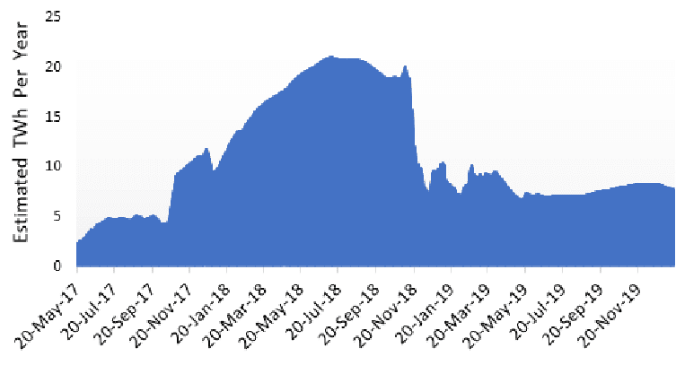
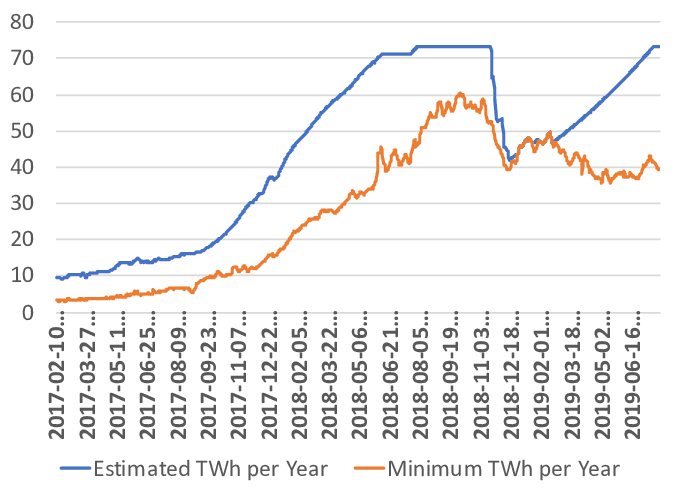
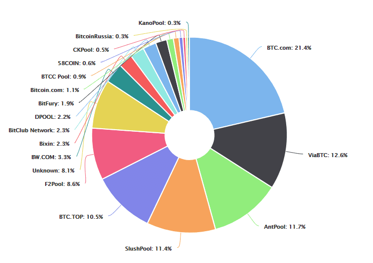
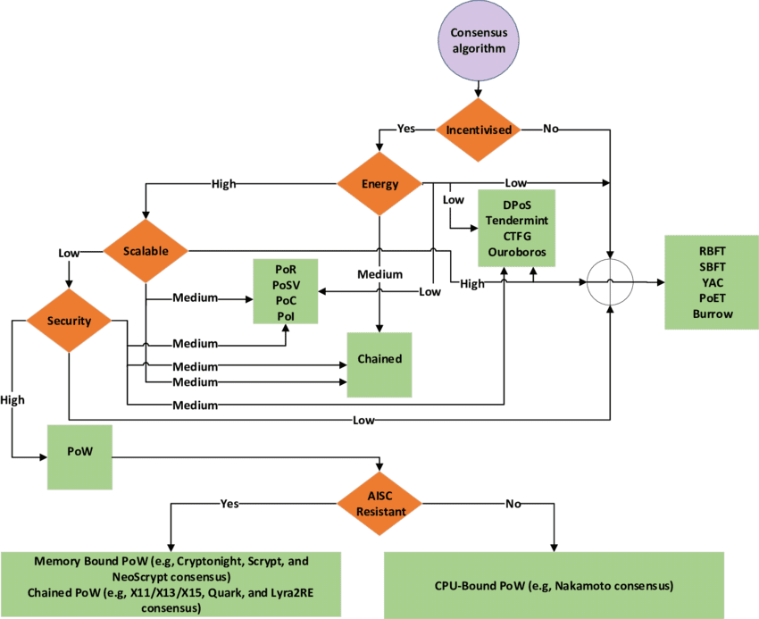

## Understanding Consensus algorithms in Blockchain based applications

### **Abstract**

In recent years, blockchain technology has received unparalleled attention from academia, industry, and governments all around the world. It is considered a technological breakthrough anticipated to disrupt several application domains touching all spheres of our lives. The sky-rocket anticipation of its potential has caused a wide-scale exploration of its usage in different application domains. This has resulted in a plethora of blockchain systems for various purposes. However, many of these blockchain systems suffer from serious shortcomings related to their performance and security, which need to be addressed before any wide-scale adoption can be achieved. A crucial component of any blockchain system is its underlying consensus algorithm, which in many ways, determines its performance and security. Therefore, to address the limitations of different blockchain systems, several existing as well novel consensus algorithms have been introduced. A systematic analysis of these algorithms will help to understand how and why any particular blockchain performs the way it functions. However, the existing studies of consensus algorithms are not comprehensive. Those studies have incomplete discussions on the properties of the algorithms and fail to analyse several major blockchain consensus algorithms in terms of their scopes. This article fills this gap by analyzing a wide range of consensus algorithms using a comprehensive taxonomy of properties and by examining the implications of different issues still prevalent in consensus algorithms in detail. The result of the analysis is presented in tabular formats, which provides a visual illustration of these algorithms in a meaningful way. We have also analyzed more than hundred top crypto-currencies belonging to different categories of consensus algorithms to understand their properties and to implicate different trends in these crypto-currencies. Finally, we have presented a decision tree of algorithms to be used as a tool to test the suitability of consensus algorithms under different criteria.

### **Motivation**

Nowadays with increasing concern about privacy people are moving towards using distributed systems. These distributed systems use blockchain as an underlying technology which in turn use consensus algorithms to decide whether a set of data is legit before adding it to a distributed ledger.
A consensus mechanism enables the blockchain network to attain reliability and build a level of trust between different nodes, while ensuring security in the environment. As these algorithms are an integral part of each and every blockchain system in the world we felt it was important to study more about these algorithms and to analyse them on the basis of different properties.

### **Aim and objectives**

- #### Aim:
    To study and analyse two major type of consensus algorithms used in blockchains.

- #### Objectives:
    - To understand the use of consensus algorithms in achieving agreement in blockchain systems.
    - To understand and study different properties of a consensus algorithm.
    - To study the Proof of Work algorithm in detail.
    - To study the Proof of Stake algorithm in detail
    - To compare and analyse PoS and PoW algorithms.

### **Background on distributed consensus**
Schneider pointed out that there are two crucial requirements to reach and maintain consensus among distributed nodes. The first requirement is a deterministic state machine. The second requirement is a consensus protocol to disseminate inputs in a timely fashion and to ensure atomic broadcast among the participating nodes. One way to achieve the design goals of such a protocol is to make certain assumptions under which the protocol is proved to function properly. These assumptions influence the critical characteristics of a consensus protocol. Next, we explore two sets of widely-used assumptions for any distributed consensus protocol.
The first set of assumptions is about the underlying networking type. Dwork et al. categorised three types of networks exhibiting different properties: synchronous, asynchronous, and partially/eventually synchronous. The latency involved in delivering a message to all nodes in a synchronous network is bound by some time denoted as ∆ . On the other hand, the latency in an asynchronous network cannot be reliably bound by any ∆ . Finally, in a partially/eventually synchronous network, it is assumed that the network will eventually act as a synchronous network, even though it might be asynchronous over some arbitrary period of time. 
The second set of assumptions is about the different properties of a consensus protocol. A consensus protocol should have the following three properties; namely consistency, availability, and fault tolerance. A well-known theorem, by Fischer, Lynch and Paterson, called FLP Impossibility has shown that a deterministic consensus protocol cannot satisfy all three properties described above in an asynchronous network. It is more common to tend to favour safety and liveness over fault tolerance in the domain of distributed system applications. A related theorem is the CAP theorem, which states that a shared replicated datastore (or, more generally, a replicated state machine) cannot achieve both consistency and availability when a network partitions in such a way that an arbitrary number of messages might be dropped.

In addition to the above assumptions, there are two major fault-tolerance models within distributed systems: crash failure (or tolerance) and Byzantine failure. The crash failure model deals with nodes that simply fail to respond due to some hardware or software failures. It may happen any time without any prior warning, and the corresponding node remains unresponsive until further actions are taken. Byzantine failure, on the other hand, deals with nodes that misbehave due to some software bugs or because of the nodes being compromised by an adversary. This type of failure was first identified and formalised by Leslie Lamport in his seminal paper with a metaphorical Byzantine General’s problems. 

A Byzantine node can behave maliciously by arbitrarily sending deceptive messages to others, which might affect the security of distributed systems. Hence, such nodes are mostly relevant in applications with security implications. To handle these two failure models, two corresponding major types of consensus mechanisms have emerged: Crash-tolerant consensus and Byzantine consensus. Next, we briefly discuss each of them, along with their associated properties.

1) Crash-tolerant consensus: Algorithms belonging to this class aim to guarantee the atomic broadcast (total order) of messages within the participating nodes in the presence of a certain number of node failures. These algorithms utilise the notion of views or epochs, which imply a certain duration of time or events. A leader is selected for each epoch who takes decisions regarding the atomic broadcast, and all other nodes comply with its decision. In case a leader fails due to a crash failure, the protocols elect a new leader to function. The best known algorithms belonging to this class can continue to function if the following condition holds: t < n/2 where t is the number of faulty nodes and n is the total number of participating nodes. Examples of some well-known crash-tolerant consensus protocol are: Paxos, Viewstamped Replication, ZooKeeper, and Raft.

2) Byzantine consensus: This class of algorithms aim to reach consensus amid certain nodes exhibiting Byzantine behaviour. Such Byzantine nodes are assumed to be under the control of an adversary and behave unpredictably with malicious intent. Similar to any crash-tolerant consensus protocol, these protocols also utilise the concept of views/epochs where a leader is elected in each view to order messages for atomic broadcast, and other honest nodes are assumed to follow the instructions from the leader. One of the most well-known algorithms under this class is called Practical Byzantine Fault Tolerant (PBFT), which can achieve consensus in the presence of a certain number of Byzantine nodes under an eventual synchronous network assumption. The tolerance level of PBFT is f < n/3 , where f is the number of Byzantine nodes and n denotes the number of total nodes participating in the network. As we will explore later, PBFT algorithms have been widely utilised in different blockchain systems.

Consensus mechanisms used by the various blockchain systems can be classified based on the reward mechanism that participating nodes might receive. Therefore, we first classify the consensus mechanisms in blockchain systems into two categories: incentivised and non-incentivised algorithms.

 - Incentivised Consensus. Some consensus algorithms reward participating nodes for creating and adding a new block in the blockchain. Such algorithms belong to this category. These algorithms are exclusively used in public blockchain systems and the reward provided acts as an incentive for participating nodes to behave accordingly and to follow the corresponding consensus protocol rigorously.
 - Non-incentivised Consensus. Private blockchain systems deploy a type of consensus algorithms that do not rely on any incentive mechanism for the participating nodes to create and add a new block in the blockchain. Such algorithms belong to this category. With the absence of any reward mechanism, these nodes are considered trusted as only authorised (allowed) nodes can participate in the block creation process of the consensus algorithm.

### **Structural Properties**
Structural properties define how different nodes within a blockchain network are structured to participate in a consensus algorithm. These properties can be subdivided into different categories as follows
1. Node types : It refers to different types of nodes that a consensus algorithm is required to engage with to achieve its consensus.
2. Structure type: It refers to the ways different nodes are structured within the consensus algorithm using the concept of a committee.
3. Underlying mechanism: It refers to the specific mechanism that a consensus algorithm deploys to select a particular node. The mechanism can utilise lottery, the age of a particular coin or a voting mechanism. A lottery can utilise either a cryptography based probabilistic mechanism or other randomised mechanisms. In a voting mechanism, voting can be carried out either in a single or multiple rounds. The coin-age, on the other hand, utilises a special property, which depends on how long a particular coin has been owned by its owner.
4. Voting committees:

    A. Single committee. A single committee refers to a special group of nodes among the participating nodes which actively participate in the consensus process by producing blocks and extending the blockchain.
   
   B. Multiple committees. It has been observed that the time it takes to achieve consensus in a single committee tends to increase as the number of the members starts to increase, thereby reducing performance. To alleviate this problem, the concept of multiple committees has been introduced, where each committee consists of different validators. A multiple committee can have different properties.

### **Block & reward properties**
Properties under this category can be utilised as quantitative metrics to differentiate different crypto-currencies. The properties are: genesis date, block reward, total supply, formula, and block creation time. These properties do not necessarily characterise different consensus algorithm directly, however, most of them (except the genesis date) have a direct and indirect impact on how consensus is achieved in a particular crypto-currency based blockchain system.

### **Security properties**
A consensus algorithm must satisfy a number of security properties and are described below:
1. Authentication: This implies if nodes participating in a consensus protocol need to be properly verified/authenticated.
2. Non-repudiation: This signifies if a consensus protocol satisfies non-repudiation.
3. Censorship resistance: This implies if the corresponding algorithm can withstand any censorship resistance.
4. Attack vectors: This property implies the attack vectors applicable to a consensus mechanism. Here, we present a set of attack vectors that are applicable to any consensus algorithm.
5. Adversary tolerance: This signifies the maximum byzantine nodes supported/tolerated by the respective protocol.
6. Sybil protection: In a Sybil attack, an attacker can duplicate his identity as required in order to achieve illicit advantages. Within a blockchain system, a sybil attack implicates the scenario when an adversary can create/control as many nodes as required within the underlying P2P network to exert influence on the distributed consensus algorithm and to taint its outcome in its favour.
7. DoS (Denial of Service) resistance: This implies if the consensus protocol has any built-in mechanism against DoS attacks.

### **Performance properties**
The properties belonging to this group can be utilised to measure the quantitative performance of a consensus protocol.
1. Fault tolerance: signifies the maximum faulty nodes the respective consensus protocol can tolerate.
2. Throughput: implies the number of transactions the protocol can process in one second.
3. Scalability: refers to the ability to grow in size and functionalities without degrading the performance of the original system.
4. Latency (Finality): refers to “the time it takes from when a transaction is proposed until consensus has been reached on it” . It is also known as finality.
5. Energy consumption: indicates if the algorithm (or the utilising system) consumes a significant amount of energy.

### **Proof of work**
A Proof of Work (PoW) mechanism involves two different parties (nodes): prover (requestor) and verifier (provider). The prover performs a resource-intensive computational task intending to achieve a goal and presents it to a verifier or a set of verifiers for validation that requires significantly less resource. The core idea is that the asymmetry, in terms of resource required, between the proof generation and validation acts intrinsically as a deterrent measure against any system abuse.
Within the blockchain setting, a similar concept has been adopted. Each PoW mechanism is bound to a threshold, known as the difficulty parameter in many blockchain systems. The prover would carry out the computational task in several rounds until a PoW is generated that matches the required threshold, and every single round is known as a single proof attempt.
1. **Compute-bound PoW** - A Compute-bound PoW, also known as CPU-bound PoW, employs a CPU-intensive function that carries out the required computational task by leveraging the capabilities of the processing units (e.g., CPU/GPU), without relying on the main memory of the system. These particular characteristics facilitate the scenario in which the computation can be massively optimized for faster calculation using Application-specific Integrated Circuit (ASIC) rigs. This has drawn criticisms among the crypto-currency enthusiasts as general people cannot participate in the mining process with their general purpose computers and the mining process is mostly centralized among a group of mining nodes.
Nakamoto consensus is the compute-bound PoW consensus algorithm leveraged in Bitcoin. It is based on the approach of Hashcash, modified to be applied within the blockchain setting. As discussed in the sections above, all mining nodes (miners) compete with each other to generate a valid block by finding a solution smaller than the difficulty target. Similar to the idea of HashCash, the miners need to engage in several proof attempts, until the solution is found. In each of these proof attempts, each miner generates a hash using either the SHA-256 or SHA-256d (a double hashing mechanism using SHA-256) algorithm and checks if the generated hash is smaller than the difficulty target. The effect of this distributed engagement is that forks happen, and then the Nakamoto consensus algorithm is utilized to resolve the fork and to achieve a network-wide distributed consensus. Currently, there are many crypto-currencies that utilise the Nakamoto consensus algorithm.
2. **Memory-bound PoW** - To counteract the major criticism of compute-bound PoWs allowing the utilization of ASIC-based rigs for the mining purpose, memory-bound PoWs have been proposed. A memory-bound PoW requires the algorithm to access the main memory several times and thus ultimately binds the performance of the algorithm within the limit of access latency and/or bandwidth as well as the size of memory. This restricts ASIC rigs based on a memory-bound PoW to have the manifold performance advantage over their CPU/GPU based counterparts. In addition, the profit margin of developing ASIC with memory and then building mining rigs with them is not viable as of now for these classes of PoWs. Because of these, memory-bound PoWs are advocated as a superior replacement for compute-bound PoWs in de-monopolizing mining concentrations around some central mining nodes. There is a large variety of consensus algorithms belonging to this class, unlike the consensus algorithms of compute-bound PoW which are largely based on Hashcash. Some of the examples of such algorithms are: Cryptonight; Scrypt and its variants; Equihash; Ethhash/Dagger; Neoscript; and Timetravel.

#### **PoW limitations**
PoW (Nakamoto) consensus algorithm has been widely accoladed for its breakthrough in the distributed consensus paradigm, starting with Bitcoin. It had laid down the foundation for the subsequent advancement, which resulted in different PoW algorithms and crypto-currencies as discussed in the earlier sections. Even so, there are some significant limitations. Next, we briefly discuss these limitations:
1. **Energy consumption**: Each PoW algorithm needs to consume electricity to compute the hash. As the difficulty of the network starts to increase, so does the energy consumption. The amount of consumed energy is quite significant when calculated over the whole network consisting of ASIC/GPU mining rigs all around the world.
 
   *Figure: Ethereum energy consumption over the last year*   
 
   *Figure: Bitcoin energy consumption over the last years*   

2. **Mining centralization**: With the ever-increasing difficulty rate, miners within a PoW-based crypto-currency network need to upgrade the capability of their ASIC/GPU mining rigs to
increase their chance of creating a new block. Even so, it becomes increasingly difficult for a single miner to join in the mining process without substantial investment in the mining rigs. A mining pool can be created where the mining resources of different miners are aggregated to increase the chance of creating a new block. Once a mining pool receives a reward for creating the next block, the reward is then proportionally divided among the participating miners. Unfortunately, this has led to the centralization problems where block creations are limited among a handful of miners. For example, only five mining pools control the 75% of hashrate of the whole network. There is a fear that they could collude with each other to launch the 51% attack to destabilize the whole Bitcoin network.
  
  *Figure: Bitcoin hashrate distribution of mining pools.*  

#### **PoW Analysis**
Different types of PoW algorithms share exactly similar characteristics. In these algorithms, they are mainly two types of nodes: clients and miners. Miners are responsible for creating a block using a randomized lottery mechanism. Conversely, clients are the nodes that are responsible for validating each block as well as utilized to transact e.g bitcoin between different users. Committees in these algorithms represent the set of miners, exhibiting the property of a single open committee structure where anyone can join as a miner. The respective committee is formed implicitly in a dynamic fashion, indicating any miner can join or leave whenever they wish. None of the algorithms requires any node to be authenticated to participate in the algorithm. All of them have strong support for non-repudiation in the form of a digital signature as part of every single transaction. These algorithms have a high level of censorship resistance, which means that it will be difficult for any regulatory agency to impose any censorship on these algorithms. As for the attack vector, each PoW algorithm requires every miner node to invest substantially for mining hardware in order to participate in these consensus algorithms. This feature,thus, acts as a deterrent against any Sybil or DoS attack in any PoW algorithm. The adversary tolerance is based on the assumption that PoW suffers from 51% attacks, and thus, adversary nodes need to have less than 50% of the total hashing power of the network.

### **Proof of Stake**
To counteract the limitations of any PoW algorithm, another type of consensus algorithm, called Proof of Stake (PoS) has been proposed. The earliest proposal of a PoS algorithm can be found on the bitcointalk forum in 2011. Soon after, several projects started experimenting with the idea. Peercoin, released in 2012, was the first currency to utilise the PoS consensus algorithm.
The core idea of PoS revolves around the concept that the nodes who would like to participate in the block creation process must prove that they own a certain number of coins at first. Besides, they must lock a certain amount of its currencies, called stake, into an escrow account in order to participate in the block creation process. The stake acts as a guarantee that it will behave as per the protocol rules. The node escrows its stake in this manner is known as the stakeholder, leader, forger, or minter in PoS terminology. The minter can lose the stake, in case it misbehaves.

#### **Advantages of PoS**
It has been argued that this incentive, coupled with any punitive mechanism, can provide a similar level of security of any PoW algorithm. Moreover, it can offer several other advantages like :
1. Energy Efficiency: A PoS algorithm does not require any node to solve a resource-intensive hard cryptographic puzzle and thus is energy efficient.
2. Mitigation of Centralization: A PoS algorithm is less impacted by the economies of scale phenomenon. Since it does not require to build up a mining rig to solve any resource-intensive cryptographic puzzle, there is no way to maximise gain by increasing any output.
3. Explicit Economic Security: A carefully designed penalty scheme in a PoS algorithm can deter any misbehaving attack, including spawn-camping. Anyone engaging in such attacks will lose their stake and banned from the system.

#### **Limitations of PoS**
Even though the variants of different PoS algorithms offer several significant advantages discussed below :
1. Collusion: If the number of validators is not large enough, it might be easier to launch a 51% attack on the corresponding consensus algorithm by colluding with other validators.
2. Wealth effect: The sole reliance on coin-wealth in a consensus algorithm or for the selection of validators creates an environment where people with a large portion of coins can exert greater influence.
3. Pre-computing (PreCom) attack : A pre- computing attack, also known as Stake-grinding attack, would allow an attacker to increase the probability of generating subsequent blocks based on the information of the current block. If there is not enough randomness included in the PoS algorithm, the attacker can attempt to pre-compute subsequent blocks by fine-tuning information of the current block.

#### **Analysis of PoS**

Only chained algorithms are based on multiple committees utilising a flat topology with a dynamic configuration. These algorithms also use a probabilistic lottery to select a minter. Conversely, other PoS algorithms, except Tendermint, are based on the single committee having an open type and explicit formation with a dynamic configuration and mostly rely on voting mechanisms. Tendermint uses a closed committee with a static configuration. These algorithms have a high level of censorship resistance, as do all PoW algorithms. As for the attack vector, each PoS algorithm requires every miner node to invest substantially to participate in this algorithm. This feature, thus, acts as a deterrent against any Sybil or DoS attack in any PoS algorithm. The adversary tolerance for Chained systems can be calculated using this formula: min(2f + 1, 3f + 1) = 3f + 1 . This is because a chained algorithm utilises both PoW and PoS algorithms and thus needs to consider the adversary tolerance for both of them. We consider the minimum of these two ( 3f + 1 ). The supported adversary tolerance for other algorithms is 3f +1 except BFT Ouroboros whose adversary tolerance is 2f + 1.

 
  *Figure: Decision tree to choose appropriate consensus algorithms.*  

### **Conclusion**
As the crypto-currencies rise, and blockchain in general, there has been a renewed interest in the practical implications of different distributed consensus algorithms. Most of the existing systems struggle to properly satisfy the need for any wide-scale real-life deployment as they have serious limitations. Many of these limitations are due to the underlying consensus algorithm used in a particular system. Therefore, in the quest to create more suitable practical blockchain systems, the principal focus has been on distributed consensus. This has led to the explorations; either existing consensus algorithms have been exploited or novel consensus mechanisms have been introduced. The ultimate consequence of this phenomenon is a wide range of consensus algorithms currently in existence. To advance the knowledge of this domain, it is essential to synthesize these consensus algorithms under a systematic study, which was the main motivation of this article.

### **References**
The Proof-of-Work Concept - Daniel Krawisz (https://nakamotoinstitute.org/mempool/the-proof-of-work-concept/)

Proof of stake - Etherum.org -  (https://ethereum.org/en/developers/docs/consensus-mechanisms/pos/)

Consensus Algorithms in Blockchain - (https://www.geeksforgeeks.org/consensus-algorithms-in-blockchain/)

What is Consensus Algorithm In Blockchain & Different Types Of Consensus Models (https://medium.com/@BangBitTech/what-is-consensus-algorithm-in-blockchain-different-types-of-consensus-models-12cce443fc77)

Properties of consensus mechanism (https://www.oreilly.com/library/view/learn-bitcoin-and/9781789536133/aa18dab5-b4f8-4de8-ad91-64dfdaffd6df.xhtml)

Blockchain Consensus Algorithms: What are their Properties? (https://medium.com/@zakayesh/blockchain-consensus-algorithms-what-are-their-properties-7400407975b8)

From Distributed Consensus Algorithms to the Blockchain Consensus Mechanism (https://www.alibabacloud.com/blog/from-distributed-consensus-algorithms-to-the-blockchain-consensus-mechanism_595315)
